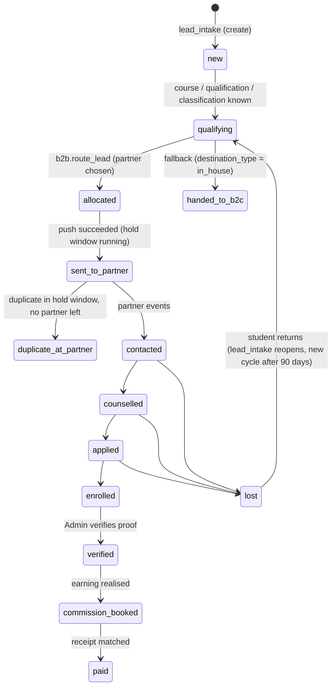
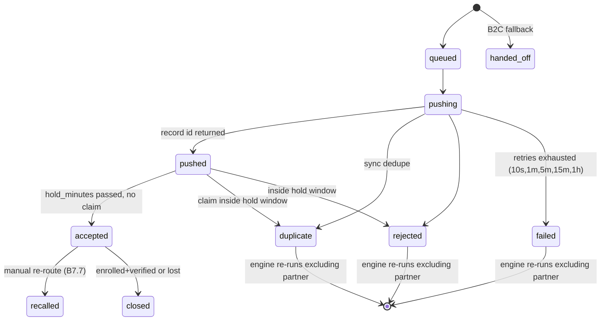

# Eduwit B2B Partner CRM: design

Version 1.1 · 6 October 2026 · Status: **approved; M0–M2 applied (staging, then production)**

Inputs: `docs/B2B_CRM_PROMPT.md` (the spec), `docs/phase0-audit.md` (the database audit), Vikas's answers of 6 Oct, the old CRM (`connect289/eduwit-crm`: `crm/sql` 001–008, `crm/web`, `CLAUDE.md`), and the n8n exports in that repo (`n8n/*.json`).

---

## 0. Decisions in force

### 0.1 Done and live

These two hotfixes went in on 6 Oct, as tracked migrations in `b2b-crm/supabase/migrations/`:

- **D1:** the influencer exposure is closed.
  - `influencer_leads_dashboard` is revoked from `anon` and `authenticated`.
  - `anon` loses INSERT, UPDATE, DELETE and TRUNCATE on `influencers`, `influencer_auth` and `student_leads`.
  - The new read path is `influencer_dashboard_leads(referral_code, password)`. It checks the password on the server and never returns it, masks phone and email, never exposes IP, excludes test leads, and locks a code for 15 minutes after 5 failed attempts.
- **D4:** `crm_auto_assign` is disabled. It is not dropped; `enable trigger` restores it.

### 0.2 Choices taken

| # | Choice |
| --- | --- |
| D2 | n8n (`Postgres account`, `6Tjv3LCAaB1eIrkt`) is privileged. Revoking `anon` and `authenticated` from internal functions breaks nothing in n8n, so it goes into M1 |
| D3 | Separate free staging project in ap-south-1. It's created only after I confirm the free plan's 2-project limit makes it $0 |
| D5 | The "finished qualifying" signal is read by the B2B CRM from what Witty already writes (section 4.2). **No Witty change** |
| D6 | The B2B CRM never sets `is_bot_paused`. Setting `destination_type` already stops Witty through `w2_crm_owned()` |
| D8 | The three inactive Gmail accounts stay. They're harmless under the allowlist |
| D9 | `enrollments` stays in `public` as a shared outcome table. The B2B CRM writes partner rows, the B2C CRM writes in-house rows. The B2B CRM owns the **receivables ledger** (rates, earnings, invoices, receipts) in `b2b`. Staff payouts stay with B2C |
| D10 | The B2B CRM writes no `crm_*` tables. Stage changes go to `b2b.events` and the outbox; B2C subscribes |
| D11 | No change to `catalog_*`. A programme a partner sells that the catalogue lacks becomes a `b2b.catalogue_requests` row, waiting for your approval to add it |
| D12 | Backup tables stay. I'll ask before dropping any (planned after 12 Nov) |
| D13 | Code lives in `b2b-crm/` in this repo. The influencer dashboard code stays outside it |
| D14 | No new paid infrastructure. The web app runs on Vercel, as the old CRM does. Workers are jobs inside Postgres (`pgmq` + `pg_cron` + `pg_net`) calling the app's internal endpoints (section 2). Cloud Run is a later option and **costs money, so I'll ask first** |

### 0.3 Needs your answer

These are blocking for go-live, not for building:

- **Partner-sharing consent.** Witty sends `consent_sales_at` only (`w2_crm_payload` → `consent_at`). It never sends `consent_partner_share_at`. Until it does, every Witty lead correctly falls back to B2C (`no_partner_consent`). Fixing it means changing Witty's consent line and adding one field to `w2_crm_payload`. **That is a change to a Witty function, so it's your call.** The consent text also needs your lawyer's approval.
- **Witty's escalation path.** On HOT escalation Witty pauses itself, adds the Chatwoot label `witty-handoff`, and assigns the chat to a Chatwoot "Counselor Team", which doesn't exist yet. Under the B2B design the escalated student goes to a partner. The B2B CRM will add a private note to the Chatwoot conversation saying "Allocated to {partner}, EDW-123, counsellor will call". I need you to confirm that note is wanted.
- **Hosting cost.** Vercel's Hobby plan forbids commercial use. The old CRM is already there. Options: stay on Hobby for staging, Vercel Pro ($20 a month) for production, or Cloud Run (pay per use, likely a few dollars a month at this volume). This is your decision.

---

## 1. What changes from the old CRM

| Old CRM (eduwit-crm) | New B2B CRM |
| --- | --- |
| One app for B2C sales, marketing and B2B | B2B only: allocation, partner sync, notifications, CAPI, partner commission, analytics and AI. B2C is a separate product |
| The in-house team competes with partners (Thompson sampling) | In-house is a **fallback only** (B7.6). Routing is commission-first, then net commission per lead |
| Seven staff roles through `crm_users` | **One Admin** through `b2b.app_users` (section 3). Partners never log in |
| Tables in `public` mixed with Witty's | Everything new in schema `b2b`. Shared objects (`student_leads`, `lead_intake`, `catalog_*`, `enrollments`) stay in `public` |
| Engine runs inside Witty's write (trigger) | An enqueue-only trigger, then the routing job (section 4.3) |
| Partner push by an n8n poller (`crm_sync_claim`) | `pgmq` queue → pushed in seconds by the app's adapter endpoint (section 2) |
| Status map as one JSON profile | Normalised mapping layer (B8.3), with coverage gates and a queue for unmapped values |
| No Programme Repository | Partner programme files (Excel or Google Sheet) decide routing candidates |

**Reused from the old CRM:**

- the Supabase SSR auth wiring (`lib/supabase/*`, `middleware.ts`);
- the Chatwoot and SMTP senders (`lib/comms/chatwoot.ts`, `email.ts`);
- the HMAC partner-event endpoint shape (`/api/v1/partner/events`);
- the Intake API shape (`/api/v1/leads`);
- money functions, logic only: `crm_compute_earning`, `crm_tier_pct`, `crm_period_close`, `crm_verify_enrollment`, `crm_refund_enrollment`;
- `crm_criteria_match`, `crm_duplicate_candidates`;
- the test style (`test_*.sql` that raise on failure and clean up) becomes pgTAP.

---

## 2. Architecture

```
Witty (n8n) ──w2_commit_turn──► lead_intake() ─┐
Website agent / forms / Meta / Google ──► POST /v1/leads (b2b app) ──► lead_intake()
                                               ▼
                         public.student_leads (shared master)
                                               │ trigger b2b_lead_changed (enqueue only, never raises)
                                               ▼
              b2b.lead_watch (small: one row per open lead, readiness + missing[])
                                               │ pgmq 'route' (and pg_cron sweep every 30 s for idle-timeout readiness)
                                               ▼
        b2b.route_lead(lead_id)  — rules layer + commission-first/performance scoring, one transaction
                                               │ allocation 'queued' + pgmq 'push'
                                               ▼
   pg_cron (every 5 s) → pg_net POST /api/internal/drain  (Vercel, x-internal-key)
        └─ adapters: generic_rest | webhook | leadsquared | … ──► partner CRM
        └─ notify: Chatwoot WhatsApp template, SMTP email
        └─ outbox: B2C webhook, lead.* events
        └─ capi: Meta CAPI, Google Ads offline conversions
Partner webhooks ──► POST /v1/partners/{slug}/events ──► b2b.partner_events (raw) ──► mapping ──► allocations, activities, lead roll-ups
Admin (connect@eduwit.in) ──► Next.js app (b2b-crm/web) ──► server actions ──► b2b.* SQL functions
```

- **One database, two runtimes.** Business rules run as SQL functions. HTTP calls to partners and providers run in the app's internal route handlers, which claim jobs from `pgmq` with a visibility timeout. A crashed run reappears and is retried idempotently. Job keys are `push:<allocation id>`, `notify:<allocation id>:<channel>`, `capi:<lead>:<stage>:<cycle>`.
- **Latency targets:** routing under 1 s (the trigger enqueues and `pg_cron` drains every 5 s; when the lead becomes ready inside `lead_intake`, the route function runs straight from the enqueue). Push under 5 s after the decision.
- **Failure isolation.** If the app is down, jobs wait in `pgmq` and Witty keeps writing. If `pg_net` fails, the next tick retries.
- **Code layout:**

  ```
  b2b-crm/
    supabase/migrations/   tracked SQL (applied to staging first, then prod with approval)
    supabase/tests/        pgTAP
    web/                   Next.js 15 App Router: UI, /v1 public API, /api/internal/* job endpoints
      lib/adapters/        partner CRM adapters (one file per type)
      lib/providers/       chatwoot, smtp, meta-capi, google-ads
    packages/shared/       types generated from the database, mapping transforms (shared by tests)
    mock-partner/          mock partner CRM server for end-to-end tests
  ```

---

## 3. Roles and permissions

### 3.1 People

**Exactly one human user: the Admin, `connect@eduwit.in`** (spec B3). There is no user management UI.

| Table | Purpose |
| --- | --- |
| `b2b.app_users` | `user_id` (= the existing `auth.users` id `c9a540e1…`), `email`, `role` (`admin` only today), `is_active`, `require_totp`, `created_at` |
| `b2b.sign_in_log` | Every sign-in attempt: method, IP, user agent, outcome. Includes refused accounts |
| `b2b.my_sessions()` | Active sessions, read from Supabase Auth's own `auth.sessions` (no extra table). Signing other devices out uses Supabase Auth (`signOut({ scope: 'others' })`). Idle expiry is 12 hours |

**Sign-in:**

- Google OAuth, or email with password and TOTP. Both resolve to the same `auth.users` identity.
- `connect@eduwit.in` has Google only today. You set a password through a reset link, and TOTP is enrolled at the first password sign-in.
- Any other identity that authenticates is signed out with "This app is restricted" and logged.
- `b2b.is_admin()` checks `app_users` on the server, **in every server action and SQL function**, not only in middleware.
- Leaked-password protection must be turned on in the Supabase dashboard, by you.

**Old roles** (`sales_head`, `sales_manager`, `marketing`, `revenue`, `finance`, `viewer`) belong to `crm_users`, and so to the B2C CRM. They give **no** access to the B2B CRM.

**Ready for more users later:**

- `app_users.role` is a column with a check list.
- Every action records `actor_type` and `actor_id`.
- RLS reads go through `b2b.can(permission)`.

So adding, say, an `analyst` (read-only) or `finance` role later is one migration plus seed rows. No redesign.

### 3.2 System actors

Each one is logged as the source of its actions.

| Actor | Authenticates with | May do | May never do |
| --- | --- | --- | --- |
| `admin` (Vikas) | Supabase session plus allowlist | Everything in the app; every "approval" is a confirm dialog that shows the impact first | Hard-delete leads, edit money lines directly (only through the workflows) |
| `engine` | Runs inside SQL functions | Write allocations and decisions; set the B2B-owned lead columns | Touch consent, Witty columns or money |
| `worker` | `/api/internal/*` with `x-internal-key` (Vault), service role | Claim jobs, call adapters and providers, record results through SQL functions | Read the UI or change settings |
| `partner:<slug>` | HMAC per partner (secret in Vault) on `/v1/partners/{slug}/events` | Submit events about **its own** allocations | Read anything; affect another partner's leads |
| `intake:<key name>` | API key with scope `intake` (hashed in `b2b.api_keys`) | `POST /v1/leads` → `lead_intake()` | Anything else |
| `product:<name>` | API key with scope `referrals` or `events` | Read masked referral outcomes; subscribe to webhooks | Personal data |
| `ai_optimiser` | Worker job with the Anthropic key in Vault | Read aggregated metric tools; write `b2b.ai_recommendations`; apply in-bounds setting changes in Autopilot (off at launch) | Personal data, consent, duplicates, fallback, rates, live switches |
| `witty` / `n8n` | Postgres role (privileged) | Calls `lead_intake()` only, as today | Is never called by the B2B CRM |

### 3.3 Database privileges

- Every `b2b` table has RLS on.
  - `select` policy: `b2b.is_admin()`.
  - No insert, update or delete policies, so all writes go through `SECURITY DEFINER` functions that check `b2b.is_admin()` or run as the service role.
- `anon` gets no grant on `b2b`.
- `authenticated` gets SELECT, guarded by RLS, plus EXECUTE on the Admin functions, which re-check `is_admin()`.
- Every function sets `search_path = b2b, public, extensions`.

---

## 4. Lead lifecycle

### 4.1 Column ownership on `student_leads`

| Owner | Columns (live names) | How written |
| --- | --- | --- |
| Witty and website agent | conversation, AI qualification, interest, profile: `student_name`, `email_id`, `interested_course`, `interested_specialization`, `university_preference`, `program_level`, `study_mode_preference`, `highest_qualification`, `academic_score_pct`, `work_experience_years_num`, `annual_budget_inr`, `enrollment_timeline`, `primary_motivation`, `lead_status`, `lead_stage` (Witty phase), `is_bot_paused`, `last_agent_message_at`, … | `lead_intake()` only |
| Intake | `lead_source`, `channel`, `campaign`, `utm_*`, `click_ids`, `referral_code`, consent stamps, `phone_verified_at`, `is_test`, `cycle_no` | `lead_intake()` only |
| **B2B CRM** | `destination_type`, `partner_id`, `allocation_id`, `allocated_at`, `allocation_reason`, `partner_record_id`, `partner_stage_raw`, `partner_sub_stage_raw`, `partner_synced_at`, `duplicate_claim_count`, `first_contacted_at`, `last_contacted_at`, `contact_attempts`, `next_task_due_at`, `application_*`, `fee_amount_inr`, `fee_paid_inr`, `enrollment_*`, `enrolled_program`, `enrolled_university`, `expected_net_revenue_inr`, `realised_net_revenue_inr`, `lost_reason`, `lost_at`, and `stage` / `sub_stage` **once the lead is allocated to a partner** | `b2b.*` SQL functions only |
| B2C CRM | the same pipeline columns for leads with `destination_type = 'in_house'`; `owner_user_id`, `team_id`, `assigned_at` | Its own functions |
| Admin corrections | any Witty-owned field, edited in the lead drawer | `b2b.correct_lead()`: writes through `lead_intake(source_system='crm')` (already supported) and records `b2b.lead_field_history` plus a `custom_fields.b2b_locked` entry so later Witty writes don't overwrite it. **Note:** making `lead_intake` honour that lock is a change to a Witty-called function, so it needs your approval later. Until then a correction can be overwritten by the next Witty turn |

### 4.2 Readiness: when a lead routes

Witty already writes everything needed:

- `lead_status` ∈ HOT/WARM/COLD (Witty classifies only after the tier-1 profile is complete);
- `lead_stage` = Witty's phase (`EARN_IT` → `QUALIFY_IT` → `ENRICH_IT`, or `ESCALATION` on a HOT hand-off);
- `is_bot_paused` = true on escalation;
- `last_agent_message_at`;
- a `touchpoints` row with `event_type` `lead.qualified` or `lead.escalated`.

`b2b.readiness(lead)` returns `ready boolean, missing text[]`. A lead is ready when **all** of these hold:

1. **Not a test lead:** `not is_test`, and the phone digits don't match `910000%` or `9190000000__`.
2. **Not deleted or merged**, and **not opted out** of being contacted.
3. **Trusted phone:** `phone_verified_at` is set, or the source is trusted (Witty's WhatsApp inbound, Meta, Google).
4. **Has a course:** `interested_course` is set, or `field_of_interest` maps to catalogue courses.
5. **No open allocation.**
6. **Finished qualifying.** Different sources meet this differently:
   - **Witty or website agent:** `lead_status` ∈ HOT/WARM/COLD, and any of:
     - (a) `lead_stage = 'ESCALATION'` or `is_bot_paused`;
     - (b) a `lead.escalated` touchpoint;
     - (c) no Witty message for `witty_idle_minutes` (default 30) after the latest `lead.qualified` or update.
   - **Meta, Google, manual:** ready at intake.
   - **Import:** per the import's choice.

Leads that aren't ready wait in the **pre-routing pool** (`b2b.lead_watch`), with their `missing[]` reasons shown in the UI.

Notes:

- Witty never sets `interested_university`; it only fills `university_preference`, which is free text. So the B2B CRM fuzzy-matches `university_preference` against `catalog_universities` and `catalog_synonyms`. The match narrows candidates only at high confidence; otherwise the lead is routed as "any university".
- Partner consent is a routing gate, not a readiness gate. A ready lead without it is handed to B2C (`no_partner_consent`).

### 4.3 How readiness is detected without slowing Witty

- **Trigger `b2b_lead_changed`** fires AFTER INSERT, or AFTER UPDATE of the few columns that matter (`lead_status`, `lead_stage`, `is_bot_paused`, `interested_course`, `consent_partner_share_at`, `deleted_at`).
  - It upserts one row into `b2b.lead_watch (lead_id, cycle_no, changed_at)` and, when the lead is ready now, sends one `pgmq` message.
  - The whole body sits in `begin … exception when others then` and only raises a warning, so it can never fail `lead_intake()`.
  - Cost is one small upsert. There are no scans and no outbound calls.
- **`pg_cron` every 30 s** re-checks `lead_watch` rows that are waiting only on the idle timeout. It reads `lead_watch`, never `student_leads` in bulk.
- **Index proposal:** `create index concurrently` on the phone digits (`crm_find_lead`'s expression), so `lead_intake` stays fast at volume. This is index-only and part of M2.

### 4.4 Eduwit stages (`student_leads.stage`)



- **Stage rank** blocks backward moves from partner events unless the status rule has `is_reopen`.
- "handed_to_b2c" is not a new stage value. The lead keeps `stage` and gets `destination_type = 'in_house'`; from then on the B2C CRM owns its pipeline.
- The settings copy (`b2b.settings.stages`) drops `assigned` and `nurture`, which belong to B2C.

### 4.5 Allocation states (`b2b.allocations.status`)

Enforced by a check constraint plus `b2b.allocation_transition(id, to_status, payload)`, the only writer.



**Limits per enquiry cycle:**

- At most 2 attempts ending `duplicate` or `rejected`.
- At most 3 partners in total.
- Then `handed_off` with the reason.

A duplicate claim after `accepted` (within 24 hours) becomes a `b2b.commission_disputes` row; the lead never cascades.

### 4.6 Routing steps (`b2b.route_lead`)

The steps run in one transaction, in B7.1 order:

1. **Consent:** no `consent_partner_share_at` → B2C (`no_partner_consent`).
2. **Candidates:** published `b2b.partner_programmes` matching course, specialization, level, mode and (when matched) university, for active partners with `live_mode` on. Test leads use `test_endpoint`. No partner offers the programme → B2C (`no_partner_offers_programme`).
3. **Exclusions:** partners that already claimed this student as a duplicate, paused partners, and partners whose `lead_criteria` the lead fails.
4. **Rules:** `fix_partner`, `narrow` and `exclude` only. B2C is never a rule target.
5. **Capacity and minimums:** partners at their daily or monthly cap drop out; contractual minimums that are behind schedule go first. No partner left → B2C (`no_capacity`).
6. **Score:**
   - Commission-first: highest CPE_net, with a seeded exploration lane (20%) while any candidate has fewer than 30 leads in the segment.
   - Performance mode is Phase 3.
7. **Commit:** the allocation (`EDW-<id>`), `b2b.engine_decisions` (every candidate, CPE and NCPL, seed, selection probability, settings version), the lead's B2B columns, stage `allocated`, and a `push` job.

---

## 5. Data model (schema `b2b`)

Conventions:

- `bigint` identity keys and `timestamptz` timestamps.
- Every row carries `created_at`; mutable rows also carry `updated_at`, `actor_type` and `actor_id`.
- Money is `numeric(12,2)`.
- No `ON DELETE CASCADE` from `student_leads`: B2B rows reference `student_leads(id)` with `RESTRICT`, because a hard delete happens only for test leads, by a privileged job that removes B2B rows first.

### 5.1 Access, settings, audit

| Table | Key columns |
| --- | --- |
| `app_users`, `sign_in_log` | Section 3.1 |
| `settings` | `key`, `value jsonb`, `version`. Seeded from `crm_settings` (engine, stages, sub_stages, lost_reasons, money, required_fields), with the new defaults below |
| `settings_versions` | `key`, `version`, `value`, `reason`, `actor_type`, `actor_id`, `ai_run_id` (B7.4 versioning; also serves as `engine_settings_versions`) |
| `events` | Append-only log: `id`, `occurred_at`, `lead_id`, `allocation_id`, `partner_id`, `type`, `actor_type`, `actor_id`, `payload`. The source for timelines, analytics and audit. Partitioned by month later, when volume needs it |
| `api_keys` | `name`, `scopes[]`, `key_hash`, `last_used_at`, `revoked_at` |
| `integration_outbox` | `event_type`, `target`, `payload`, `status`, `attempts`, `next_attempt_at`, `delivered_at`, `idempotency_key` |
| `webhook_subscriptions` | `product`, `url`, `event_types[]`, `secret_id` (Vault) |

New engine defaults, versus today's `crm_settings.engine`:

- `exploration_share` 0.20 (was `exploration_floor` 0.10);
- `share_cap` null, meaning off (was 0.70);
- `fixed_split` empty (was in-house 100);
- `min_learning_leads` 30, `maturity_days` 60, `half_life_days` 30, `prior_weight` 20, `default_p_enroll` 0.05;
- `attempt_limit` 2, `partner_limit` 3, `witty_idle_minutes` 30.

### 5.2 Intake and leads

| Table | Key columns |
| --- | --- |
| `lead_watch` | `lead_id` (PK), `cycle_no`, `ready`, `missing[]`, `ready_at`, `changed_at`, `routed_at`. The pre-routing pool |
| `import_jobs`, `import_rows`, `import_mappings` | B4.1 wizard: file path (Storage), mapping, consent basis, routing choice, per-row result, rollback deadline |
| `lead_field_history` | `lead_id`, `field`, `old`, `new`, `actor_type`, `actor_id`, `at` |
| `lead_deletions` | Soft delete, restore and erasure log: `lead_id`, `action`, `reason`, `request_ref`, `actor`, `row_count`, `job_id` |
| `lead_exports` | Filter, columns, row count, file path, expiry, actor |
| `meta_form_mappings`, `google_form_mappings` | Per-form question → lead field map |

Soft delete uses the existing `student_leads.deleted_at` (B2B-owned for this purpose; `crm_find_lead` already ignores deleted rows).

### 5.3 Partners and the Programme Repository

| Table | Key columns |
| --- | --- |
| `partners` | Moved from `public`, plus the B5.1 fields: `display_name`, `logo_url`, `brand_color`, `adapter_type` (`leadsquared`, `salesforce`, `zoho`, `meritto`, `hubspot`, `generic_rest`, `webhook`), `dedupe_mode`, `hold_minutes`, `duplicate_window_hours`, `notify_enabled`, `test_endpoint`, `working_hours`, `holidays`, `sla`, caps, `contract_min_monthly`, `lead_criteria`, `live_mode`, `status`, `outbound_secret_id` and `inbound_secret_id` (Vault). The plain secret columns are dropped (they're empty) |
| `partner_documents` | Agreement and data-processing terms (Storage path, signed date) |
| `partner_programme_sources` | One per partner: `type` (upload or gsheet), `sheet_id`, `tab`, `column_template`, `sync_every_hours`, `auto_publish`, `last_checked_at`, `last_changed_at` |
| `partner_programme_versions` | `source_id`, `file_path` or `sheet_revision`, `status` (draft, published, superseded, rolled_back), counts, `uploaded_by`, `published_by`, timestamps |
| `partner_programme_rows` | `version_id`, `raw`, `normalised`, `programme_id`, `match_method`, `confidence`, `review_status`, `ignore_reason` |
| `partner_programmes` | **Live offers:** `partner_id`, `programme_id` → `catalog_programs(id)`, `partner_course_code`, partner fees, eligibility, `active`, `valid_from`, `valid_to`, `source_version_id`. Unique on (`partner_id`, `programme_id`, `valid_from`) |
| `catalogue_requests` | Partner programmes missing from the catalogue, waiting for your approval (D11) |

### 5.4 Routing

| Table | Key columns |
| --- | --- |
| `allocations` | Moved from `public` and reshaped: `lead_id`, `cycle_no`, `segment`, `destination_type` (partner, in_house), `partner_id`, `reference` (`EDW-<id>`), `status` (section 4.5), `mode` (commission_first, performance, exploration, rule, manual, fallback, holdout), `attempt_no`, `reason`, `cpe_net_inr`, `ncpl_inr`, `hold_until`, `accepted_at`, `notify_status`, `selection_probability`, `model_version`, `engine_decision_id`, `partner_record_id`, partner raw stage, `first_contact_at`, `last_event_at`, `outcome`, `outcome_at`, `override`. Unique index on open states (one open per lead) |
| `allocation_transitions` | `allocation_id`, `from`, `to`, `payload`, `actor`, `at` |
| `engine_decisions` | Moved and extended: `segment`, `policy`, `candidates` (each with CPE, P̂, NCPL, eligibility reason), `winner`, `seed`, `settings_version`, `model_version`, `feature_hash`, `selection_probability` |
| `routing_rules` | Moved and reshaped: `priority`, `name`, `conditions`, `action` (`fix_partner`, `narrow`, `exclude`), `active`, `version` |
| `segment_modes` | Segment pin (commission_first or performance), expiry, reason |
| `commission_disputes` | Duplicate claims after acceptance: proof, status (open, upheld, rejected), resolution |

### 5.5 Sync and mapping (B8)

| Table | Key columns |
| --- | --- |
| `partner_events` | Moved, plus `lead_id`, `mapping_version`, `status` (received, applied, held_unmapped, error), `sequence` |
| `partner_activities` | B8.2 columns: `allocation_id`, `lead_id`, `partner_id`, `kind`, `direction`, `outcome`, `duration_sec`, `counsellor_name`, `counsellor_external_id`, `occurred_at`, `raw`, `mapped` |
| `canonical_fields` | Seeded from the stages, sub-stages, lost reasons, B3 columns, sales properties and picklists |
| `partner_schema_snapshots`, `mapping_profiles`, `mapping_pipelines`, `status_rules`, `field_rules`, `value_rules`, `activity_rules`, `mapping_queue` | B8.3.6 (normalised; `partner_mapping_profiles` is retired: it's empty) |
| `sync_health` | Per partner: last event, p50 and p95 lag, error rate, backlog, dead letters (refreshed by `pg_cron`) |
| `reconciliation_runs`, `reconciliation_items` | Nightly comparison results |

### 5.6 Student notifications, CAPI, hand-off

| Table | Key columns |
| --- | --- |
| `message_templates` | `channel`, `language`, `kind` (accepted, b2c_accepted, reroute_update, counsellor_intro), body, WhatsApp template name and variables, `status` |
| `student_notifications` | B9 columns: `lead_id`, `allocation_id`, `partner_id`, `channel`, `template_id`, `variables`, `provider_message_id`, `status`, `scheduled_for`, `sent_at`, `error`. Unique on (`allocation_id`, `channel`, `kind`) |
| `conversion_events` | B11 columns: `lead_id`, `platform`, `event_name`, `event_id` (deterministic), `value_inr`, `status`, `response`, `sent_at` |
| `live_switches` | `scope` (partner id, `whatsapp`, `email`, `capi_meta`, `capi_google`), `live`, `switched_by`, `at`, `reason`. Everything is off by default |

### 5.7 Money (receivables ledger; D9)

| Table | Key columns |
| --- | --- |
| `public.enrollments` | **Stays shared.** Add `allocation_id` and `source_product` (b2b, b2c) by migration. Partner rows are written by the B2B CRM |
| `earning_rates` | Moved, plus scope `partner_programme`, `superseded_by`, `reason`, actor columns |
| `earnings` | Moved. Lines are never deleted (a trigger blocks DELETE); reversals use `reverses_id` |
| `invoices` | Moved, plus GSTIN, SAC, sequential `number` per financial year, lines |
| `receipts` | Amount, TDS, bank reference, received date, matched invoice or earning lines |
| `partner_statements`, `statement_lines`, `statement_matches` | B12 reconciliation (matched, partner only, Eduwit only, amount mismatch) |

B2C's staff payouts (`payout_rates`, `payouts`, `payout_runs`, `crm_compute_payout`) stay in `public`. They read realised earnings through a view `b2b.earnings_for_b2c`.

### 5.8 Analytics and AI (Phases 3 and 4; tables created then)

- Analytics: `metric_definitions`, `dashboards`, `dashboard_widgets`, `metric_alerts`, `report_schedules`, `saved_views`, and `rollup_*` tables refreshed every minute from `events`.
- AI and ML: `ml_models`, `ai_runs`, `ai_recommendations`. The holdout is `allocations.mode = 'holdout'`.

### 5.9 Published contracts

| Contract | For |
| --- | --- |
| `lead_intake(p jsonb)` | Unchanged; the only lead writer |
| `w2_crm_owned()` | Unchanged; the B2B CRM sets `destination_type` at allocation |
| `public.b2b_referral_outcomes` (view, masked, `security_invoker`) and `GET /v1/referrals/{code}/outcomes` | The redesigned influencer dashboard. Fields: referral code, lead created date, stage, enrolled yes or no, programme. Never a phone or email |
| Webhooks `lead.allocated`, `lead.accepted`, `lead.status_changed`, `lead.enrolled`, `b2c.lead_handed_off` | Other products (HMAC signed) |

---

## 6. Connections to Witty and n8n

| Workflow or component | Today | Under the B2B CRM |
| --- | --- | --- |
| **Eduwit Witty** `PKPs7tXg9bej8AgX` (148 nodes, live) | Writes the lead through `w2_commit_turn` → `w2_crm_payload` → `lead_intake()`, inside a savepoint (a failure goes to `w2_outbox` and is retried every minute, so a CRM error never blocks a reply). Reads `crm_owned` to stop chatting. On HOT escalation: Chatwoot label `witty-handoff`, `bot_paused`, a `w2_events` row of type `handoff` | **No change.** The B2B CRM reads `student_leads` and `touchpoints`, and adds a private Chatwoot note on allocation (pending your answer in 0.3). Alignment items for later (all Witty changes, all need your approval): send `consent_partner_share_at`; send `interested_university` once the student confirms a programme; change the hand-off wording to "an academic counsellor from our partner will call you" |
| **Witty 2.0 · Test Harness** `1BGAINw5XDkSHb2q` | Test phones `910000…` | The B2B CRM never routes these to a real partner; they may go to a partner's `test_endpoint` |
| **Meta Leads to WhatsApp Alert** `M4WnPdy9MEXsj30d` (active) | Meta Lead Ads → Google Sheet plus a WhatsApp alert to sales | Phase 2: Meta `leadgen` → B2B `/v1/webhooks/meta/leadgen` → `lead_intake()`. This workflow keeps running until the B2B intake is live and verified; then you switch it off (I won't touch n8n) |
| **WhatsApp Ad Leads to Sheet** `aCONIEjJDytbRcXV` (active) | Logs Meta WhatsApp webhook messages to a Sheet | Unchanged (out of scope). Click IDs from WhatsApp ads already reach `student_leads.click_ids` through Witty's `w2_clicks` |
| **Eduwit CRM · Jobs** `Wx1uai9qtOkwFQDs` (unpublished) | Would tick the old CRM | Not needed. The B2B CRM's timers run in `pg_cron`. Leave it unpublished; archive it when the old CRM retires |
| **Eduwit CRM · Partner Sync Worker** `UhSUqceTwQeuI5rR` (unpublished) | Would push through `crm_sync_claim` | Replaced by `pgmq` plus `/api/internal/drain`. **It must stay unpublished**: after M5 the functions it calls no longer exist |
| Chatwoot (chat.eduwit.in, inbox 4, +91 96439 77407) | Witty's channel | B9 WhatsApp notifications go out as approved templates through Chatwoot's API on the same number (default B21). A reply reaches Witty, which already stops selling once `crm_owned`. The fixed-line answer plus support alert needs a Witty change, so it's **your call**; until then replies land in Chatwoot for a human |
| SMTP (Google Workspace) | Old CRM email | B9 emails. SPF, DKIM and DMARC need checking on the sending domain |
| Exotel, MSG91 | Old CRM calls and OTP | Not used by the B2B CRM (B2C and the website agent) |

---

## 7. Migration plan

Every step:

- is one file in `b2b-crm/supabase/migrations/`;
- is applied to **staging first**, with pgTAP tests passing there;
- is then applied to production **only after you approve that step**.

Steps marked ⚠ need an explicit yes because they touch shared objects.

| Step | What | Risk and reversibility |
| --- | --- | --- |
| ✅ H1 | `crm_auto_assign` disabled | Done. `enable trigger` reverts it |
| ✅ H2 | Influencer exposure closed, plus `influencer_dashboard_leads()` | Done. Grants can be re-added |
| ✅ **M0** | **Baseline.** Generate the current schema (tables, constraints, indexes, functions, views, triggers, policies, grants, RLS flags) from the database catalog into `00000000000000_baseline.sql`. Create the staging project, apply the baseline, and seed it with synthetic test leads only (never production data) | No production change |
| ✅ **M1** | **Lock down functions (D2).** Revoke EXECUTE from `anon` and `authenticated` on internal `SECURITY DEFINER` functions with no role check (`lead_intake`, `crm_partner_*`, `crm_sync_*`, `crm_api_key_check`, the trigger functions, `rls_auto_enable`), leaving `w2_*` as they are. n8n uses the privileged Postgres role, and the old CRM's server calls use the service role | ⚠ The old CRM's UI calls some functions as `authenticated` (for example `crm_new_lead`, which has `crm_require`). Only functions **without** a role check are revoked, so its role-gated features keep working |
| ✅ **M2** | `create extension pgmq, pg_cron` (pg_net is already installed); `create schema b2b`; `app_users` (seeded with the Admin), `sign_in_log`, `app_sessions`, `settings` (+ versions, copied from `crm_settings`), `events`, `api_keys`, `integration_outbox`, `live_switches`; `b2b.is_admin()`; RLS; grants. Index on phone digits for `crm_find_lead` (`CONCURRENTLY`, not in a transaction) | New objects only. The extensions are free on our plan |
| **M3** | ⚠ **Move the empty B2B tables.** `alter table … set schema b2b` for `partners`, `allocations`, `partner_events`, `routing_rules`, `engine_decisions`, `earning_rates`, `earnings`, `invoices`. In the same transaction: drop the old engine and sync functions that only served them, plus the view `partners_v`; widen `search_path` on the shared functions that still reference them (`crm_merge_leads`, `crm_apply_stage_system`, `crm_report_enrollment`, `crm_money_summary`, `crm_period_close`, `crm_verify_enrollment`, `crm_refund_enrollment`, `crm_invoice_set_status`, `crm_add_earning_rate`, `crm_earning_rate`, `crm_conversion`, `crm_scorecards`). `engine_decisions` row 1 moves with its table | Tables are empty, so no data moves. **Effect on the old CRM:** its Partners and Engine screens stop working, which is intended; its Money screens keep working through the widened `search_path` until M6. Rollback: `set schema public` plus re-create the functions from the M0 baseline |
| **M4** | Reshape the moved tables (allocation state machine with `pending` → `queued` and `assigned` → `handed_off`, CASCADE → RESTRICT, new partner fields, `partner_programme` rate scope, Vault secret IDs replacing secret columns); `allocation_transition()`; Programme Repository tables; `lead_watch`; the readiness function; the **enqueue-only trigger `b2b_lead_changed` on `student_leads`** ⚠ | The trigger is the only new object on a shared table; it never raises and is tested against `lead_intake` on staging, with a timing check, before production |
| **M5** | `b2b.route_lead` (commission-first plus exploration plus B2C fallback); push, notify and outbox jobs; partner event intake (generic mapping); `student_notifications`; `commission_disputes`; the B2C hand-off contract | New functions. The engine stays off in production until a partner has `live_mode` on |
| **M6** | Money: `public.enrollments` gets `allocation_id` and `source_product` ⚠ (adds columns to a shared table); `receipts`; statements; invoice fields; the delete-blocking trigger on money lines; `b2b.earnings_for_b2c` view | Additive only |
| **M7…** | Mapping layer (Phase 2), CAPI, imports, analytics rollups, AI and ML tables (Phases 3 and 4) | Separate plans |

### 7.1 Retiring the old CRM cleanly

1. **After M3 and M5:** the old CRM's Partners, Engine and partner-events API are superseded by the B2B CRM. Keep `eduwit-crm.vercel.app` online for B2C features (leads, agenda, comms, marketing, payouts) until the B2C CRM exists.
2. **The B2B CRM takes over:**
   - `POST /v1/leads` (Intake API with the same body), so the website forms and any keys move to the new URL;
   - `POST /v1/partners/{slug}/events` replaces `/api/v1/partner/events`;
   - CSV import.
3. **The website agent's OTP endpoints** (`/api/v1/verify/*`) belong to the website agent and the B2C side. They stay in the old CRM until those products take them.
4. **When the B2C CRM is live:**
   - turn off the old Vercel project;
   - archive the n8n workflows `Wx1uai9qtOkwFQDs` and `UhSUqceTwQeuI5rR`;
   - re-enable or drop `crm_auto_assign` according to the B2C design;
   - drop the B2C functions it no longer needs (your approval).
5. **Nothing in the old CRM is deleted by the B2B work** beyond the B2B-only functions in M3, which the baseline keeps in git.

---

### 7.2 What M0–M2 actually did (6 Oct 2026)

- **M0:**
  - `b2b-crm/supabase/migrations/00000000000000_baseline.sql` was generated from production's catalog: 71 tables, 175 functions, 6 views, 7 triggers, 38 policies, grants and RLS.
  - It excludes n8n's internal tables and the `*_backup_*` tables.
  - Staging project `mplbspysxmtohnlwpbti` was created on the free plan and loaded from it. Its object counts match production.
- **M1:**
  - 27 unchecked definer functions are revoked from `anon` and `authenticated`.
  - `is_admin` and `current_referral_code` are revoked from `anon`.
  - 10 functions the old CRM UI calls are wrapped. The original moves to `<name>__impl`, and a wrapper refuses signed-in non-staff.
  - Tested on staging first.
- **M2:** applied as five parts (`m2a`…`m2e`), because the Supabase connector holds large or `DROP`-containing migrations for confirmation.
  - Objects: schema `b2b`, `pgmq` 1.5.1, `pg_cron` 1.6.4.
  - Allowlist: `app_users`, seeded with connect@eduwit.in.
  - Logs: `sign_in_log` with a 5-failure lockout, and append-only `events`.
  - Settings: versioned, with a reason required for every change; 10 keys seeded.
  - `api_keys` (hashed), `integration_outbox`, and `live_switches` (all off).
  - The phone-digits index on `student_leads`, confirmed used by `crm_find_lead`'s query.
  - 22 behaviour checks passed on staging before production.
- **Change from the design:** there is no `revoke_session` SQL function. Deleting from `auth.sessions` from SQL is avoided; the app uses Supabase Auth's sign-out instead.
- **Pending:** `b2b-crm/supabase/pending/drop_tmp_transfer.sql`. The temporary objects used to copy the schema to staging need a confirmed `DROP`. API access to them is already revoked.

## 8. Build order after approval

1. **M0, then M1 and M2 on staging.** Then the app shell (`b2b-crm/web`): Admin-only sign-in (Google, email and password with TOTP), allowlist enforced on the server, light and dark tokens built on the Eduwit logo's colours (navy `#0B2F5E` primary, amber `#F5A800` accent; this replaces the spec's indigo accent at Vikas's request), the Eduwit logo, ⌘K, an empty Command Center. Deployed as a staging preview.
2. **Phase 1:**
   - M3–M5 and the Master Lead Table (soft delete, Recycle Bin, export);
   - Partners and the Programme Repository (Excel first, then Google Sheet);
   - rates and CPE;
   - commission-first routing with exploration;
   - the generic REST and webhook adapters plus the mock partner server;
   - the duplicate cascade and B2C hand-off;
   - WhatsApp and email notifications (live switches off);
   - the 50-test-lead end-to-end suite from B20.
3. **Phases 2–4** as the spec describes, each with its own plan.

**Your answers needed now:**

1. Approve this design, or give changes.
2. Approve **M0–M2** to start, including creating the free staging project and enabling `pgmq` and `pg_cron`.
3. The three items in 0.3: consent through Witty, the Chatwoot note, hosting.
