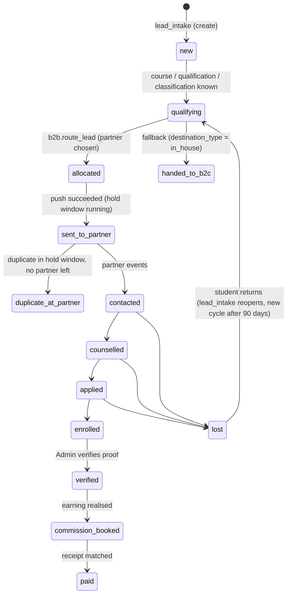
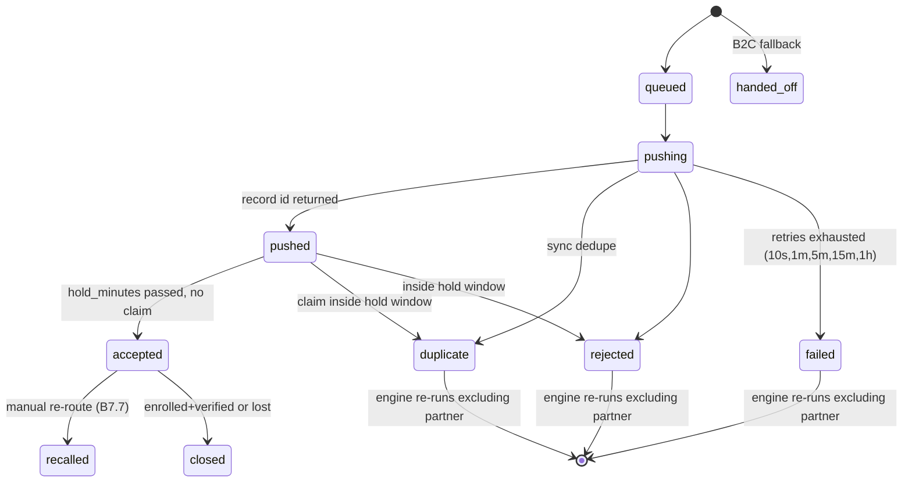

# Eduwit B2B Partner CRM: design

Version 1.1 · 6 October 2026 · Status: **approved; M0–M2 applied (staging, then production)**

Inputs: `docs/B2B_CRM_PROMPT.md` (the spec), `docs/phase0-audit.md` (the database audit), Vikas's answers of 6 Oct, the old CRM (`connect289/eduwit-crm`: `crm/sql` 001–008, `crm/web`, `CLAUDE.md`), and the n8n exports in that repo (`n8n/*.json`).

---

## 0. Decisions in force

### 0.1 Done and live

These two hotfixes went in on 6 Oct, as tracked migrations in `b2b-crm/supabase/migrations/`:

- **D1:** the influencer exposure is closed.
  - `influencer_leads_dashboard` is revoked from `anon` and `authenticated`.
  - `anon` loses INSERT, UPDATE, DELETE and TRUNCATE on `influencers`, `influencer_auth` and `student_leads`.
  - The new read path is `influencer_dashboard_leads(referral_code, password)`. It checks the password on the server and never returns it, masks phone and email, never exposes IP, excludes test leads, and locks a code for 15 minutes after 5 failed attempts.
- **D4:** `crm_auto_assign` is disabled. It is not dropped; `enable trigger` restores it.

### 0.2 Choices taken

| # | Choice |
| --- | --- |
| D2 | n8n (`Postgres account`, `6Tjv3LCAaB1eIrkt`) is privileged. Revoking `anon` and `authenticated` from internal functions breaks nothing in n8n, so it goes into M1 |
| D3 | Separate free staging project in ap-south-1. It's created only after I confirm the free plan's 2-project limit makes it $0 |
| D5 | The "finished qualifying" signal is read by the B2B CRM from what Witty already writes (section 4.2). **No Witty change** |
| D6 | The B2B CRM never sets `is_bot_paused`. Setting `destination_type` already stops Witty through `w2_crm_owned()` |
| D8 | The three inactive Gmail accounts stay. They're harmless under the allowlist |
| D9 | `enrollments` stays in `public` as a shared outcome table. The B2B CRM writes partner rows, the B2C CRM writes in-house rows. The B2B CRM owns the **receivables ledger** (rates, earnings, invoices, receipts) in `b2b`. Staff payouts stay with B2C |
| D10 | The B2B CRM writes no `crm_*` tables. Stage changes go to `b2b.events` and the outbox; B2C subscribes |
| D11 | No change to `catalog_*`. A programme a partner sells that the catalogue lacks becomes a `b2b.catalogue_requests` row, waiting for your approval to add it |
| D12 | Backup tables stay. I'll ask before dropping any (planned after 12 Nov) |
| D13 | Code lives in `b2b-crm/` in this repo. The influencer dashboard code stays outside it |
| D14 | No new paid infrastructure. The web app runs on Vercel, as the old CRM does. Workers are jobs inside Postgres (`pgmq` + `pg_cron` + `pg_net`) calling the app's internal endpoints (section 2). Cloud Run is a later option and **costs money, so I'll ask first** |

### 0.3 Needs your answer

These are blocking for go-live, not for building:

- **Partner-sharing consent.** Witty sends `consent_sales_at` only (`w2_crm_payload` → `consent_at`). It never sends `consent_partner_share_at`. Until it does, every Witty lead correctly falls back to B2C (`no_partner_consent`). Fixing it means changing Witty's consent line and adding one field to `w2_crm_payload`. **That is a change to a Witty function, so it's your call.** The consent text also needs your lawyer's approval.
- **Witty's escalation path.** On HOT escalation Witty pauses itself, adds the Chatwoot label `witty-handoff`, and assigns the chat to a Chatwoot "Counselor Team", which doesn't exist yet. Under the B2B design the escalated student goes to a partner. The B2B CRM will add a private note to the Chatwoot conversation saying "Allocated to {partner}, EDW-123, counsellor will call". I need you to confirm that note is wanted.
- **Hosting cost.** Vercel's Hobby plan forbids commercial use. The old CRM is already there. Options: stay on Hobby for staging, Vercel Pro ($20 a month) for production, or Cloud Run (pay per use, likely a few dollars a month at this volume). This is your decision.

---

## 1. What changes from the old CRM

| Old CRM (eduwit-crm) | New B2B CRM |
| --- | --- |
| One app for B2C sales, marketing and B2B | B2B only: allocation, partner sync, notifications, CAPI, partner commission, analytics and AI. B2C is a separate product |
| The in-house team competes with partners (Thompson sampling) | In-house is a **fallback only** (B7.6). Routing is commission-first, then net commission per lead |
| Seven staff roles through `crm_users` | **One Admin** through `b2b.app_users` (section 3). Partners never log in |
| Tables in `public` mixed with Witty's | Everything new in schema `b2b`. Shared objects (`student_leads`, `lead_intake`, `catalog_*`, `enrollments`) stay in `public` |
| Engine runs inside Witty's write (trigger) | An enqueue-only trigger, then the routing job (section 4.3) |
| Partner push by an n8n poller (`crm_sync_claim`) | `pgmq` queue → pushed in seconds by the app's adapter endpoint (section 2) |
| Status map as one JSON profile | Normalised mapping layer (B8.3), with coverage gates and a queue for unmapped values |
| No Programme Repository | Partner programme files (Excel or Google Sheet) decide routing candidates |

**Reused from the old CRM:**

- the Supabase SSR auth wiring (`lib/supabase/*`, `middleware.ts`);
- the Chatwoot and SMTP senders (`lib/comms/chatwoot.ts`, `email.ts`);
- the HMAC partner-event endpoint shape (`/api/v1/partner/events`);
- the Intake API shape (`/api/v1/leads`);
- money functions, logic only: `crm_compute_earning`, `crm_tier_pct`, `crm_period_close`, `crm_verify_enrollment`, `crm_refund_enrollment`;
- `crm_criteria_match`, `crm_duplicate_candidates`;
- the test style (`test_*.sql` that raise on failure and clean up) becomes pgTAP.

---

## 2. Architecture

```
Witty (n8n) ──w2_commit_turn──► lead_intake() ─┐
Website agent / forms / Meta / Google ──► POST /v1/leads (b2b app) ──► lead_intake()
                                               ▼
                         public.student_leads (shared master)
                                               │ trigger b2b_lead_changed (enqueue only, never raises)
                                               ▼
              b2b.lead_watch (small: one row per open lead, readiness + missing[])
                                               │ pgmq 'route' (and pg_cron sweep every 30 s for idle-timeout readiness)
                                               ▼
        b2b.route_lead(lead_id)  — rules layer + commission-first/performance scoring, one transaction
                                               │ allocation 'queued' + pgmq 'push'
                                               ▼
   pg_cron (every 5 s) → pg_net POST /api/internal/drain  (Vercel, x-internal-key)
        └─ adapters: generic_rest | webhook | leadsquared | … ──► partner CRM
        └─ notify: WhatsApp template (Meta Cloud API), email (Resend or Brevo)
        └─ outbox: B2C webhook, lead.* events
        └─ capi: Meta CAPI, Google Ads offline conversions
Partner webhooks ──► POST /v1/partners/{slug}/events ──► b2b.partner_events (raw) ──► mapping ──► allocations, activities, lead roll-ups
Admin (connect@eduwit.in) ──► Next.js app (b2b-crm/web) ──► server actions ──► b2b.* SQL functions
```

- **One database, two runtimes.** Business rules run as SQL functions. HTTP calls to partners and providers run in the app's internal route handlers, which claim jobs from `pgmq` with a visibility timeout. A crashed run reappears and is retried idempotently. Job keys are `push:<allocation id>`, `notify:<allocation id>:<channel>`, `capi:<lead>:<stage>:<cycle>`.
- **Latency targets:** routing under 1 s (the trigger enqueues and `pg_cron` drains every 5 s; when the lead becomes ready inside `lead_intake`, the route function runs straight from the enqueue). Push under 5 s after the decision.
- **Failure isolation.** If the app is down, jobs wait in `pgmq` and Witty keeps writing. If `pg_net` fails, the next tick retries.
- **Code layout:**

  ```
  b2b-crm/
    supabase/migrations/   tracked SQL (applied to staging first, then prod with approval)
    supabase/tests/        pgTAP
    web/                   Next.js 15 App Router: UI, /v1 public API, /api/internal/* job endpoints
      lib/adapters/        partner CRM adapters (one file per type)
      lib/providers/       chatwoot, smtp, meta-capi, google-ads
    packages/shared/       types generated from the database, mapping transforms (shared by tests)
    mock-partner/          mock partner CRM server for end-to-end tests
  ```

---

## 3. Roles and permissions

### 3.1 People

**Exactly one human user: the Admin, `connect@eduwit.in`** (spec B3). There is no user management UI.

| Table | Purpose |
| --- | --- |
| `b2b.app_users` | `user_id` (= the existing `auth.users` id `c9a540e1…`), `email`, `role` (`admin` only today), `is_active`, `require_totp`, `created_at` |
| `b2b.sign_in_log` | Every sign-in attempt: method, IP, user agent, outcome. Includes refused accounts |
| `b2b.my_sessions()` | Active sessions, read from Supabase Auth's own `auth.sessions` (no extra table). Signing other devices out uses Supabase Auth (`signOut({ scope: 'others' })`). Idle expiry is 12 hours |

**Sign-in:**

- Google OAuth, or email with password and TOTP. Both resolve to the same `auth.users` identity.
- `connect@eduwit.in` has Google only today. You set a password through a reset link, and TOTP is enrolled at the first password sign-in.
- Any other identity that authenticates is signed out with "This app is restricted" and logged.
- `b2b.is_admin()` checks `app_users` on the server, **in every server action and SQL function**, not only in middleware.
- Leaked-password protection must be turned on in the Supabase dashboard, by you.

**Old roles** (`sales_head`, `sales_manager`, `marketing`, `revenue`, `finance`, `viewer`) belong to `crm_users`, and so to the B2C CRM. They give **no** access to the B2B CRM.

**Ready for more users later:**

- `app_users.role` is a column with a check list.
- Every action records `actor_type` and `actor_id`.
- RLS reads go through `b2b.can(permission)`.

So adding, say, an `analyst` (read-only) or `finance` role later is one migration plus seed rows. No redesign.

### 3.2 System actors

Each one is logged as the source of its actions.

| Actor | Authenticates with | May do | May never do |
| --- | --- | --- | --- |
| `admin` (Vikas) | Supabase session plus allowlist | Everything in the app; every "approval" is a confirm dialog that shows the impact first | Hard-delete leads, edit money lines directly (only through the workflows) |
| `engine` | Runs inside SQL functions | Write allocations and decisions; set the B2B-owned lead columns | Touch consent, Witty columns or money |
| `worker` | `/api/internal/*` with `x-internal-key` (Vault), service role | Claim jobs, call adapters and providers, record results through SQL functions | Read the UI or change settings |
| `partner:<slug>` | HMAC per partner (secret in Vault) on `/v1/partners/{slug}/events` | Submit events about **its own** allocations | Read anything; affect another partner's leads |
| `intake:<key name>` | API key with scope `intake` (hashed in `b2b.api_keys`) | `POST /v1/leads` → `lead_intake()` | Anything else |
| `product:<name>` | API key with scope `referrals` or `events` | Read masked referral outcomes; subscribe to webhooks | Personal data |
| `ai_optimiser` | Worker job with the Anthropic key in Vault | Read aggregated metric tools; write `b2b.ai_recommendations`; apply in-bounds setting changes in Autopilot (off at launch) | Personal data, consent, duplicates, fallback, rates, live switches |
| `witty` / `n8n` | Postgres role (privileged) | Calls `lead_intake()` only, as today | Is never called by the B2B CRM |

### 3.3 Database privileges

- Every `b2b` table has RLS on.
  - `select` policy: `b2b.is_admin()`.
  - No insert, update or delete policies, so all writes go through `SECURITY DEFINER` functions that check `b2b.is_admin()` or run as the service role.
- `anon` gets no grant on `b2b`.
- `authenticated` gets SELECT, guarded by RLS, plus EXECUTE on the Admin functions, which re-check `is_admin()`.
- Every function sets `search_path = b2b, public, extensions`.

---

## 4. Lead lifecycle

### 4.1 Column ownership on `student_leads`

| Owner | Columns (live names) | How written |
| --- | --- | --- |
| Witty and website agent | conversation, AI qualification, interest, profile: `student_name`, `email_id`, `interested_course`, `interested_specialization`, `university_preference`, `program_level`, `study_mode_preference`, `highest_qualification`, `academic_score_pct`, `work_experience_years_num`, `annual_budget_inr`, `enrollment_timeline`, `primary_motivation`, `lead_status`, `lead_stage` (Witty phase), `is_bot_paused`, `last_agent_message_at`, … | `lead_intake()` only |
| Intake | `lead_source`, `channel`, `campaign`, `utm_*`, `click_ids`, `referral_code`, consent stamps, `phone_verified_at`, `is_test`, `cycle_no` | `lead_intake()` only |
| **B2B CRM** | `destination_type`, `partner_id`, `allocation_id`, `allocated_at`, `allocation_reason`, `partner_record_id`, `partner_stage_raw`, `partner_sub_stage_raw`, `partner_synced_at`, `duplicate_claim_count`, `first_contacted_at`, `last_contacted_at`, `contact_attempts`, `next_task_due_at`, `application_*`, `fee_amount_inr`, `fee_paid_inr`, `enrollment_*`, `enrolled_program`, `enrolled_university`, `expected_net_revenue_inr`, `realised_net_revenue_inr`, `lost_reason`, `lost_at`, and `stage` / `sub_stage` **once the lead is allocated to a partner** | `b2b.*` SQL functions only |
| B2C CRM | the same pipeline columns for leads with `destination_type = 'in_house'`; `owner_user_id`, `team_id`, `assigned_at` | Its own functions |
| Admin corrections | any Witty-owned field, edited in the lead drawer | `b2b.correct_lead()`: writes through `lead_intake(source_system='crm')` (already supported) and records `b2b.lead_field_history` plus a `custom_fields.b2b_locked` entry so later Witty writes don't overwrite it. **Note:** making `lead_intake` honour that lock is a change to a Witty-called function, so it needs your approval later. Until then a correction can be overwritten by the next Witty turn |

### 4.2 Readiness: when a lead routes

Witty already writes everything needed:

- `lead_status` ∈ HOT/WARM/COLD (Witty classifies only after the tier-1 profile is complete);
- `lead_stage` = Witty's phase (`EARN_IT` → `QUALIFY_IT` → `ENRICH_IT`, or `ESCALATION` on a HOT hand-off);
- `is_bot_paused` = true on escalation;
- `last_agent_message_at`;
- a `touchpoints` row with `event_type` `lead.qualified` or `lead.escalated`.

`b2b.readiness(lead)` returns `ready boolean, missing text[]`. A lead is ready when **all** of these hold:

1. **Not a test lead:** `not is_test`, and the phone digits don't match `910000%` or `9190000000__`.
2. **Not deleted or merged**, and **not opted out** of being contacted.
3. **Trusted phone:** `phone_verified_at` is set, or the source is trusted (Witty's WhatsApp inbound, Meta, Google).
4. **Has a course:** `interested_course` is set, or `field_of_interest` maps to catalogue courses.
5. **No open allocation.**
6. **Finished qualifying.** Different sources meet this differently:
   - **Witty or website agent:** `lead_status` ∈ HOT/WARM/COLD, and any of:
     - (a) `lead_stage = 'ESCALATION'` or `is_bot_paused`;
     - (b) a `lead.escalated` touchpoint;
     - (c) no Witty message for `witty_idle_minutes` (default 30) after the latest `lead.qualified` or update.
   - **Meta, Google, manual:** ready at intake.
   - **Import:** per the import's choice.

Leads that aren't ready wait in the **pre-routing pool** (`b2b.lead_watch`), with their `missing[]` reasons shown in the UI.

Notes:

- Witty never sets `interested_university`; it only fills `university_preference`, which is free text. So the B2B CRM fuzzy-matches `university_preference` against `catalog_universities` and `catalog_synonyms`. The match narrows candidates only at high confidence; otherwise the lead is routed as "any university".
- Partner consent is a routing gate, not a readiness gate. A ready lead without it is handed to B2C (`no_partner_consent`).

### 4.3 How readiness is detected without slowing Witty

- **Trigger `b2b_lead_changed`** fires AFTER INSERT, or AFTER UPDATE of the few columns that matter (`lead_status`, `lead_stage`, `is_bot_paused`, `interested_course`, `consent_partner_share_at`, `deleted_at`).
  - It upserts one row into `b2b.lead_watch (lead_id, cycle_no, changed_at)` and, when the lead is ready now, sends one `pgmq` message.
  - The whole body sits in `begin … exception when others then` and only raises a warning, so it can never fail `lead_intake()`.
  - Cost is one small upsert. There are no scans and no outbound calls.
- **`pg_cron` every 30 s** re-checks `lead_watch` rows that are waiting only on the idle timeout. It reads `lead_watch`, never `student_leads` in bulk.
- **Index proposal:** `create index concurrently` on the phone digits (`crm_find_lead`'s expression), so `lead_intake` stays fast at volume. This is index-only and part of M2.

### 4.4 Eduwit stages (`student_leads.stage`)



- **Stage rank** blocks backward moves from partner events unless the status rule has `is_reopen`.
- "handed_to_b2c" is not a new stage value. The lead keeps `stage` and gets `destination_type = 'in_house'`; from then on the B2C CRM owns its pipeline.
- The settings copy (`b2b.settings.stages`) drops `assigned` and `nurture`, which belong to B2C.

### 4.5 Allocation states (`b2b.allocations.status`)

Enforced by a check constraint plus `b2b.allocation_transition(id, to_status, payload)`, the only writer.



**Limits per enquiry cycle:**

- At most 2 attempts ending `duplicate` or `rejected`.
- At most 3 partners in total.
- Then `handed_off` with the reason.

A duplicate claim after `accepted` (within 24 hours) becomes a `b2b.commission_disputes` row; the lead never cascades.

### 4.6 Routing steps (`b2b.route_lead`)

The steps run in one transaction, in B7.1 order:

1. **Consent:** no `consent_partner_share_at` → B2C (`no_partner_consent`).
2. **Candidates:** published `b2b.partner_programmes` matching course, specialization, level, mode and (when matched) university, for active partners with `live_mode` on. Test leads use `test_endpoint`. No partner offers the programme → B2C (`no_partner_offers_programme`).
3. **Exclusions:** partners that already claimed this student as a duplicate, paused partners, and partners whose `lead_criteria` the lead fails.
4. **Rules:** `fix_partner`, `narrow` and `exclude` only. B2C is never a rule target.
5. **Capacity and minimums:** partners at their daily or monthly cap drop out; contractual minimums that are behind schedule go first. No partner left → B2C (`no_capacity`).
6. **Score:**
   - Commission-first: highest CPE_net, with a seeded exploration lane (20%) while any candidate has fewer than 30 leads in the segment.
   - Performance mode is Phase 3.
7. **Commit:** the allocation (`EDW-<id>`), `b2b.engine_decisions` (every candidate, CPE and NCPL, seed, selection probability, settings version), the lead's B2B columns, stage `allocated`, and a `push` job.

---

## 5. Data model (schema `b2b`)

Conventions:

- `bigint` identity keys and `timestamptz` timestamps.
- Every row carries `created_at`; mutable rows also carry `updated_at`, `actor_type` and `actor_id`.
- Money is `numeric(12,2)`.
- No `ON DELETE CASCADE` from `student_leads`: B2B rows reference `student_leads(id)` with `RESTRICT`, because a hard delete happens only for test leads, by a privileged job that removes B2B rows first.

### 5.1 Access, settings, audit

| Table | Key columns |
| --- | --- |
| `app_users`, `sign_in_log` | Section 3.1 |
| `settings` | `key`, `value jsonb`, `version`. Seeded from `crm_settings` (engine, stages, sub_stages, lost_reasons, money, required_fields), with the new defaults below |
| `settings_versions` | `key`, `version`, `value`, `reason`, `actor_type`, `actor_id`, `ai_run_id` (B7.4 versioning; also serves as `engine_settings_versions`) |
| `events` | Append-only log: `id`, `occurred_at`, `lead_id`, `allocation_id`, `partner_id`, `type`, `actor_type`, `actor_id`, `payload`. The source for timelines, analytics and audit. Partitioned by month later, when volume needs it |
| `api_keys` | `name`, `scopes[]`, `key_hash`, `last_used_at`, `revoked_at` |
| `integration_outbox` | `event_type`, `target`, `payload`, `status`, `attempts`, `next_attempt_at`, `delivered_at`, `idempotency_key` |
| `webhook_subscriptions` | `product`, `url`, `event_types[]`, `secret_id` (Vault) |

New engine defaults, versus today's `crm_settings.engine`:

- `exploration_share` 0.20 (was `exploration_floor` 0.10);
- `share_cap` null, meaning off (was 0.70);
- `fixed_split` empty (was in-house 100);
- `min_learning_leads` 30, `maturity_days` 60, `half_life_days` 30, `prior_weight` 20, `default_p_enroll` 0.05;
- `attempt_limit` 2, `partner_limit` 3, `witty_idle_minutes` 30.

### 5.2 Intake and leads

| Table | Key columns |
| --- | --- |
| `lead_watch` | `lead_id` (PK), `cycle_no`, `ready`, `missing[]`, `ready_at`, `changed_at`, `routed_at`. The pre-routing pool |
| `import_jobs`, `import_rows`, `import_mappings` | B4.1 wizard: file path (Storage), mapping, consent basis, routing choice, per-row result, rollback deadline |
| `lead_field_history` | `lead_id`, `field`, `old`, `new`, `actor_type`, `actor_id`, `at` |
| `lead_deletions` | Soft delete, restore and erasure log: `lead_id`, `action`, `reason`, `request_ref`, `actor`, `row_count`, `job_id` |
| `lead_exports` | Filter, columns, row count, file path, expiry, actor |
| `meta_form_mappings`, `google_form_mappings` | Per-form question → lead field map |

Soft delete uses the existing `student_leads.deleted_at` (B2B-owned for this purpose; `crm_find_lead` already ignores deleted rows).

### 5.3 Partners and the Programme Repository

| Table | Key columns |
| --- | --- |
| `partners` | Moved from `public`, plus the B5.1 fields: `display_name`, `logo_url`, `brand_color`, `adapter_type` (`leadsquared`, `salesforce`, `zoho`, `meritto`, `hubspot`, `generic_rest`, `webhook`), `dedupe_mode`, `hold_minutes`, `duplicate_window_hours`, `notify_enabled`, `test_endpoint`, `working_hours`, `holidays`, `sla`, caps, `contract_min_monthly`, `lead_criteria`, `live_mode`, `status`, `outbound_secret_id` and `inbound_secret_id` (Vault). The plain secret columns are dropped (they're empty) |
| `partner_documents` | Agreement and data-processing terms (Storage path, signed date) |
| `partner_programme_sources` | One per partner: `type` (upload or gsheet), `sheet_id`, `tab`, `column_template`, `sync_every_hours`, `auto_publish`, `last_checked_at`, `last_changed_at` |
| `partner_programme_versions` | `source_id`, `file_path` or `sheet_revision`, `status` (draft, published, superseded, rolled_back), counts, `uploaded_by`, `published_by`, timestamps |
| `partner_programme_rows` | `version_id`, `raw`, `normalised`, `programme_id`, `match_method`, `confidence`, `review_status`, `ignore_reason` |
| `partner_programmes` | **Live offers:** `partner_id`, `programme_id` → `catalog_programs(id)`, `partner_course_code`, partner fees, eligibility, `active`, `valid_from`, `valid_to`, `source_version_id`. Unique on (`partner_id`, `programme_id`, `valid_from`) |
| `catalogue_requests` | Partner programmes missing from the catalogue, waiting for your approval (D11) |

### 5.4 Routing

| Table | Key columns |
| --- | --- |
| `allocations` | Moved from `public` and reshaped: `lead_id`, `cycle_no`, `segment`, `destination_type` (partner, in_house), `partner_id`, `reference` (`EDW-<id>`), `status` (section 4.5), `mode` (commission_first, performance, exploration, rule, manual, fallback, holdout), `attempt_no`, `reason`, `cpe_net_inr`, `ncpl_inr`, `hold_until`, `accepted_at`, `notify_status`, `selection_probability`, `model_version`, `engine_decision_id`, `partner_record_id`, partner raw stage, `first_contact_at`, `last_event_at`, `outcome`, `outcome_at`, `override`. Unique index on open states (one open per lead) |
| `allocation_transitions` | `allocation_id`, `from`, `to`, `payload`, `actor`, `at` |
| `engine_decisions` | Moved and extended: `segment`, `policy`, `candidates` (each with CPE, P̂, NCPL, eligibility reason), `winner`, `seed`, `settings_version`, `model_version`, `feature_hash`, `selection_probability` |
| `routing_rules` | Moved and reshaped: `priority`, `name`, `conditions`, `action` (`fix_partner`, `narrow`, `exclude`), `active`, `version` |
| `segment_modes` | Segment pin (commission_first or performance), expiry, reason |
| `commission_disputes` | Duplicate claims after acceptance: proof, status (open, upheld, rejected), resolution |

### 5.5 Sync and mapping (B8)

| Table | Key columns |
| --- | --- |
| `partner_events` | Moved, plus `lead_id`, `mapping_version`, `status` (received, applied, held_unmapped, error), `sequence` |
| `partner_activities` | B8.2 columns: `allocation_id`, `lead_id`, `partner_id`, `kind`, `direction`, `outcome`, `duration_sec`, `counsellor_name`, `counsellor_external_id`, `occurred_at`, `raw`, `mapped` |
| `canonical_fields` | Seeded from the stages, sub-stages, lost reasons, B3 columns, sales properties and picklists |
| `partner_schema_snapshots`, `mapping_profiles`, `mapping_pipelines`, `status_rules`, `field_rules`, `value_rules`, `activity_rules`, `mapping_queue` | B8.3.6 (normalised; `partner_mapping_profiles` is retired: it's empty) |
| `sla_checks` | One clock per allocation and SLA (B8.5): start, due time in the partner's working hours, met, met late, breached, void |
| (sync health) | Computed on read by `b2b.partner_sync`: last event, p50 and p95 lag, error rate, backlog, dead letters. No stored table |
| `reconciliation_runs`, `reconciliation_items` | Nightly comparison results |

### 5.6 Student notifications, CAPI, hand-off

| Table | Key columns |
| --- | --- |
| `message_templates` | `channel`, `language`, `kind` (accepted, b2c_accepted, reroute_update, counsellor_intro), body, WhatsApp template name and variables, `status` |
| `student_notifications` | B9 columns: `lead_id`, `allocation_id`, `partner_id`, `channel`, `template_id`, `variables`, `provider_message_id`, `status`, `scheduled_for`, `sent_at`, `error`. Unique on (`allocation_id`, `channel`, `kind`) |
| `conversion_events` | B11 columns: `lead_id`, `platform`, `event_name`, `event_id` (deterministic), `value_inr`, `status`, `response`, `sent_at` |
| `live_switches` | `scope` (partner id, `whatsapp`, `email`, `capi_meta`, `capi_google`), `live`, `switched_by`, `at`, `reason`. Everything is off by default |

### 5.7 Money (receivables ledger; D9)

| Table | Key columns |
| --- | --- |
| `public.enrollments` | **Stays shared.** Add `allocation_id` and `source_product` (b2b, b2c) by migration. Partner rows are written by the B2B CRM |
| `earning_rates` | Moved, plus scope `partner_programme`, `superseded_by`, `reason`, actor columns |
| `earnings` | Moved. Lines are never deleted (a trigger blocks DELETE); reversals use `reverses_id` |
| `invoices` | Moved, plus GSTIN, SAC, sequential `number` per financial year, lines |
| `receipts` | Amount, TDS, bank reference, received date, matched invoice or earning lines |
| `partner_statements`, `statement_lines`, `statement_matches` | B12 reconciliation (matched, partner only, Eduwit only, amount mismatch) |

B2C's staff payouts (`payout_rates`, `payouts`, `payout_runs`, `crm_compute_payout`) stay in `public`. They read realised earnings through a view `b2b.earnings_for_b2c`.

### 5.8 Analytics and AI (Phases 3 and 4; tables created then)

- Analytics: `metric_definitions`, `dashboards`, `dashboard_widgets`, `metric_alerts`, `report_schedules`, `saved_views`, and `rollup_*` tables refreshed every minute from `events`.
- AI and ML: `ml_models`, `ai_runs`, `ai_recommendations`. The holdout is `allocations.mode = 'holdout'`.

### 5.9 Published contracts

| Contract | For |
| --- | --- |
| `lead_intake(p jsonb)` | Unchanged; the only lead writer |
| `w2_crm_owned()` | Unchanged; the B2B CRM sets `destination_type` at allocation |
| `public.b2b_referral_outcomes` (view, masked, `security_invoker`) and `GET /v1/referrals/{code}/outcomes` | The redesigned influencer dashboard. Fields: referral code, lead created date, stage, enrolled yes or no, programme. Never a phone or email |
| Webhooks `lead.allocated`, `lead.accepted`, `lead.status_changed`, `lead.enrolled`, `b2c.lead_handed_off` | Other products (HMAC signed) |

---

## 6. Connections to Witty and n8n

| Workflow or component | Today | Under the B2B CRM |
| --- | --- | --- |
| **Eduwit Witty** `PKPs7tXg9bej8AgX` (148 nodes, live) | Writes the lead through `w2_commit_turn` → `w2_crm_payload` → `lead_intake()`, inside a savepoint (a failure goes to `w2_outbox` and is retried every minute, so a CRM error never blocks a reply). Reads `crm_owned` to stop chatting. On HOT escalation: Chatwoot label `witty-handoff`, `bot_paused`, a `w2_events` row of type `handoff` | **No change.** The B2B CRM reads `student_leads` and `touchpoints`, and adds a private Chatwoot note on allocation (pending your answer in 0.3). Alignment items for later (all Witty changes, all need your approval): send `consent_partner_share_at`; send `interested_university` once the student confirms a programme; change the hand-off wording to "an academic counsellor from our partner will call you" |
| **Witty 2.0 · Test Harness** `1BGAINw5XDkSHb2q` | Test phones `910000…` | The B2B CRM never routes these to a real partner; they may go to a partner's `test_endpoint` |
| **Meta Leads to WhatsApp Alert** `M4WnPdy9MEXsj30d` (active) | Meta Lead Ads → Google Sheet plus a WhatsApp alert to sales | Phase 2: Meta `leadgen` → B2B `/v1/webhooks/meta/leadgen` → `lead_intake()`. This workflow keeps running until the B2B intake is live and verified; then you switch it off (I won't touch n8n) |
| **WhatsApp Ad Leads to Sheet** `aCONIEjJDytbRcXV` (active) | Logs Meta WhatsApp webhook messages to a Sheet | Unchanged (out of scope). Click IDs from WhatsApp ads already reach `student_leads.click_ids` through Witty's `w2_clicks` |
| **Eduwit CRM · Jobs** `Wx1uai9qtOkwFQDs` (unpublished) | Would tick the old CRM | Not needed. The B2B CRM's timers run in `pg_cron`. Leave it unpublished; archive it when the old CRM retires |
| **Eduwit CRM · Partner Sync Worker** `UhSUqceTwQeuI5rR` (unpublished) | Would push through `crm_sync_claim` | Replaced by `pgmq` plus `/api/internal/drain`. **It must stay unpublished**: after M5 the functions it calls no longer exist |
| Chatwoot (chat.eduwit.in, inbox 4, +91 96439 77407) | Witty's channel | B9 WhatsApp notifications go out as approved templates on the same number, sent straight to Meta's Cloud API from Postgres (pg_net) rather than through Chatwoot's API (built that way in M9; Chatwoot still receives the replies through its webhook). A reply reaches Witty, which already stops selling once `crm_owned`. The fixed-line answer plus support alert needs a Witty change, so it's **your call**; until then replies land in Chatwoot for a human |
| SMTP (Google Workspace) | Old CRM email | Not used: pg_net speaks HTTP only, so B9 emails go through Resend or Brevo's HTTP API (M9). SPF, DKIM and DMARC for the provider need adding on the sending domain |
| Exotel, MSG91 | Old CRM calls and OTP | Not used by the B2B CRM (B2C and the website agent) |

---

## 7. Migration plan

Every step:

- is one file in `b2b-crm/supabase/migrations/`;
- is applied to **staging first**, with pgTAP tests passing there;
- is then applied to production **only after you approve that step**.

Steps marked ⚠ need an explicit yes because they touch shared objects.

| Step | What | Risk and reversibility |
| --- | --- | --- |
| ✅ H1 | `crm_auto_assign` disabled | Done. `enable trigger` reverts it |
| ✅ H2 | Influencer exposure closed, plus `influencer_dashboard_leads()` | Done. Grants can be re-added |
| ✅ **M0** | **Baseline.** Generate the current schema (tables, constraints, indexes, functions, views, triggers, policies, grants, RLS flags) from the database catalog into `00000000000000_baseline.sql`. Create the staging project, apply the baseline, and seed it with synthetic test leads only (never production data) | No production change |
| ✅ **M1** | **Lock down functions (D2).** Revoke EXECUTE from `anon` and `authenticated` on internal `SECURITY DEFINER` functions with no role check (`lead_intake`, `crm_partner_*`, `crm_sync_*`, `crm_api_key_check`, the trigger functions, `rls_auto_enable`), leaving `w2_*` as they are. n8n uses the privileged Postgres role, and the old CRM's server calls use the service role | ⚠ The old CRM's UI calls some functions as `authenticated` (for example `crm_new_lead`, which has `crm_require`). Only functions **without** a role check are revoked, so its role-gated features keep working |
| ✅ **M2** | `create extension pgmq, pg_cron` (pg_net is already installed); `create schema b2b`; `app_users` (seeded with the Admin), `sign_in_log`, `app_sessions`, `settings` (+ versions, copied from `crm_settings`), `events`, `api_keys`, `integration_outbox`, `live_switches`; `b2b.is_admin()`; RLS; grants. Index on phone digits for `crm_find_lead` (`CONCURRENTLY`, not in a transaction) | New objects only. The extensions are free on our plan |
| **M3** | ⚠ **Move the empty B2B tables.** `alter table … set schema b2b` for `partners`, `allocations`, `partner_events`, `routing_rules`, `engine_decisions`, `earning_rates`, `earnings`, `invoices`. In the same transaction: drop the old engine and sync functions that only served them, plus the view `partners_v`; widen `search_path` on the shared functions that still reference them (`crm_merge_leads`, `crm_apply_stage_system`, `crm_report_enrollment`, `crm_money_summary`, `crm_period_close`, `crm_verify_enrollment`, `crm_refund_enrollment`, `crm_invoice_set_status`, `crm_add_earning_rate`, `crm_earning_rate`, `crm_conversion`, `crm_scorecards`). `engine_decisions` row 1 moves with its table | Tables are empty, so no data moves. **Effect on the old CRM:** its Partners and Engine screens stop working, which is intended; its Money screens keep working through the widened `search_path` until M6. Rollback: `set schema public` plus re-create the functions from the M0 baseline |
| **M4** | Reshape the moved tables (allocation state machine with `pending` → `queued` and `assigned` → `handed_off`, CASCADE → RESTRICT, new partner fields, `partner_programme` rate scope, Vault secret IDs replacing secret columns); `allocation_transition()`; Programme Repository tables; `lead_watch`; the readiness function; the **enqueue-only trigger `b2b_lead_changed` on `student_leads`** ⚠ | The trigger is the only new object on a shared table; it never raises and is tested against `lead_intake` on staging, with a timing check, before production |
| **M5** | `b2b.route_lead` (commission-first plus exploration plus B2C fallback); push, notify and outbox jobs; partner event intake (generic mapping); `student_notifications`; `commission_disputes`; the B2C hand-off contract | New functions. The engine stays off in production until a partner has `live_mode` on |
| **M6** | Money: `public.enrollments` gets `allocation_id` and `source_product` ⚠ (adds columns to a shared table); `receipts`; statements; invoice fields; the delete-blocking trigger on money lines; `b2b.earnings_for_b2c` view | Additive only |
| **M7…** | Mapping layer (Phase 2), CAPI, imports, analytics rollups, AI and ML tables (Phases 3 and 4) | Separate plans |

**As built (6 Oct 2026).** The migration files in `b2b-crm/supabase/migrations/` are numbered by build order, not by
the steps above: `m3_*` leads, `m4*` partners, `m5*` Programme Repository, `m6a–c` routing (rates, rules,
`engine_decisions`, `allocations`, `b2b.route_core`, the admin functions and the `b2b-route-ready-leads` pg_cron job).
There is no trigger on `student_leads`: the cron job reads ready leads instead. Routing sets
`student_leads.destination_type`, which makes `w2_crm_owned` true, so Witty stops chatting once a lead is routed.

**Addenda 1 and 2 (6 Oct 2026, `docs/B2B_CRM_ADDENDUM_1.md`, `_2.md`; Addendum 2 wins).** Migrations `m7a–e`.
Order of checks in `b2b.route_decide`: junk or programme mismatch → not passed (`b2b.not_passed`); once with B2C →
stays with B2C (`b2c.lead_reenquired`); B2C-created → B2C sales; paid campaign → B2C sales; not qualified → B2C
nurture; rules to B2C; no consent → B2C sales; partner routing with its fallbacks (B2C sales). Chat leads are decided
at their hand-off point (escalation, paused bot, or 30 minutes idle), other sources at once. Every B2C hand-off logs
`b2c.lead_handed_off` with the lane; B2B never messages the student.

Conflicts with work already done, and what is still open:

| Item | Status |
| --- | --- |
| Rules could not name B2C (main prompt) | Changed: action `to_b2c` with a lane |
| Leads missing course or verified phone waited in the pool | Changed: at their decision point they go to B2C nurture |
| Readiness waited for Witty to classify (HOT/WARM/COLD) | Changed: after 30 idle minutes an unclassified chat is unqualified → nurture |
| Witty stops chatting once `destination_type` is set (`w2_crm_owned`) | **Open.** Addendum 1 §4b wants Witty to keep talking to nurture leads and stop only on partner acceptance or a B2C counsellor (`owner_user_id`). This is a Witty change; not made. Until then Witty also stops for B2C leads |
| Witty's interest signal for B2C pool leads (§4b) | Open, Witty side |
| Eduwit-branded fallback message to the student | Never built; `b2c_sends_own_notification = true` |
| Delivery to the B2C CRM (`POST /v1/handoffs`, `GET /v1/handoffs?since=`), `POST /v1/leads/{id}/route-to-partners`, `POST /v1/events/b2ccrm` | Open: events are recorded in `b2b.events`; the endpoints come with the integration work |
| `b2b.lead_routed_to_partner` when a partner accepts | Open: needs the push adapter (acceptance) |
| Partner lost → B2C nurture | Built (`b2b.allocation_partner_lost`); called by hand from the drawer until partner sync exists |
| Late partner activity on a lost lead → dispute alert | Open, with partner sync |
| CAPI "disqualified" signal for junk | Setting stored (off); CAPI not built |
| B2C stages `nurture`, `assigned`, `dormant`, `routed_to_partner` | Added to the stage list as `held_by_b2c` |
| Money ledgers separate, `b2c_enrollment_money_v` | Unchanged so far; the B2C view does not exist yet |

### 7.1 Retiring the old CRM cleanly

1. **After M3 and M5:** the old CRM's Partners, Engine and partner-events API are superseded by the B2B CRM. Keep `eduwit-crm.vercel.app` online for B2C features (leads, agenda, comms, marketing, payouts) until the B2C CRM exists.
2. **The B2B CRM takes over:**
   - `POST /v1/leads` (Intake API with the same body), so the website forms and any keys move to the new URL;
   - `POST /v1/partners/{slug}/events` replaces `/api/v1/partner/events`;
   - CSV import.
3. **The website agent's OTP endpoints** (`/api/v1/verify/*`) belong to the website agent and the B2C side. They stay in the old CRM until those products take them.
4. **When the B2C CRM is live:**
   - turn off the old Vercel project;
   - archive the n8n workflows `Wx1uai9qtOkwFQDs` and `UhSUqceTwQeuI5rR`;
   - re-enable or drop `crm_auto_assign` according to the B2C design;
   - drop the B2C functions it no longer needs (your approval).
5. **Nothing in the old CRM is deleted by the B2B work** beyond the B2B-only functions in M3, which the baseline keeps in git.

---

### 7.2 What M0–M2 actually did (6 Oct 2026)

- **M0:**
  - `b2b-crm/supabase/migrations/00000000000000_baseline.sql` was generated from production's catalog: 71 tables, 175 functions, 6 views, 7 triggers, 38 policies, grants and RLS.
  - It excludes n8n's internal tables and the `*_backup_*` tables.
  - Staging project `mplbspysxmtohnlwpbti` was created on the free plan and loaded from it. Its object counts match production.
- **M1:**
  - 27 unchecked definer functions are revoked from `anon` and `authenticated`.
  - `is_admin` and `current_referral_code` are revoked from `anon`.
  - 10 functions the old CRM UI calls are wrapped. The original moves to `<name>__impl`, and a wrapper refuses signed-in non-staff.
  - Tested on staging first.
- **M2:** applied as five parts (`m2a`…`m2e`), because the Supabase connector holds large or `DROP`-containing migrations for confirmation.
  - Objects: schema `b2b`, `pgmq` 1.5.1, `pg_cron` 1.6.4.
  - Allowlist: `app_users`, seeded with connect@eduwit.in.
  - Logs: `sign_in_log` with a 5-failure lockout, and append-only `events`.
  - Settings: versioned, with a reason required for every change; 10 keys seeded.
  - `api_keys` (hashed), `integration_outbox`, and `live_switches` (all off).
  - The phone-digits index on `student_leads`, confirmed used by `crm_find_lead`'s query.
  - 22 behaviour checks passed on staging before production.
- **Change from the design:** there is no `revoke_session` SQL function. Deleting from `auth.sessions` from SQL is avoided; the app uses Supabase Auth's sign-out instead.
- **M2f (audit fixes):** RLS policies evaluate `b2b.is_admin()` once per statement instead of once per row; `set_setting` accepts only known keys and object or array values; the influencer read function caps input lengths and its attempt log is purged nightly by `pg_cron`; `anon` lost SELECT on `student_leads`, `influencers` and `influencer_auth`; the auth trigger function has an explicit grant for the auth service role (trigger firing was verified not to need it).
- **M2g (6 Oct, Vikas's decision):** no authenticator code for Google sign-in, which relies on the Google account's own 2-step verification (`app_users.require_totp = false`). Password and emailed-link sessions still need a TOTP-verified session; `b2b.is_admin()` checks the JWT's `amr` methods.
- **M3 (6 Oct): Leads.** `b2b.leads_list` (keyset paging, sort by created / last activity / name), `leads_facets`, `lead_detail` (lead, touchpoints, read-only Witty messages, events, deletions), `leads_soft_delete` (reason required; blocked for leads with an enrollment, and for partner leads unless junk, spam or student request), `leads_restore` (refused when a newer lead with the same phone exists) and `leads_export` (masked option). Audit in `b2b.lead_deletions`, `b2b.lead_exports` and `b2b.events`. Filters are built by `b2b.lead_filter_sql` with every value embedded as a literal. Test leads (`910000…`, `9190000000NN`, `is_test`) are hidden unless asked for. Soft delete sets `student_leads.deleted_at`, which `lead_intake()` already respects: a deleted student who messages again becomes a new lead. Lead editing waits for an approved lock in `lead_intake()`.
- **M4a/M4b (6 Oct): Partners.** `public.partners` (empty) moved to `b2b.partners`. Instead of dropping the old CRM's 12 partner and engine functions, their `search_path` was widened to `public, b2b`, so nothing that existed stops working; they stay revoked from `anon` and `authenticated` (M1). Adapter types widened to `leadsquared`, `salesforce`, `zoho`, `meritto`, `hubspot`, `generic_rest`, `webhook` (`portal` removed). New B5.1 fields with checks (https-only URLs, `#RRGGBB`, sync dedupe ⇒ hold 0). The Admin reads every column except the old plain-secret ones; writes only through `b2b.partner_save`, `partner_set_status` (pause and close need a reason; closing switches the partner off) and `partner_set_live` (on needs an active partner and the whole go-live checklist). **Deviation:** the partner's live state is `b2b.live_switches` scope `partner:<id>`, not a `live_mode` column, so every live switch has one source of truth and one audit trail. Checklist items whose screens are not built yet (agreement, programmes, credentials, mapping, test leads) report `available: false`, so no partner can go live yet.
- **M5a–M5d (6 Oct): Programme Repository.** Tables `partner_programme_sources`, `partner_programme_versions`, `partner_programme_rows`, `partner_programmes` (live offers; ended with `valid_to`, never deleted; one live offer per partner and programme) and `catalogue_requests`, plus the private Storage bucket `b2b-programme-files` (original files, service role only). Offers reference `catalog_programs` by `id` and `program_key` **without a foreign key**, so nothing on `catalog_*` changes; programmes missing from the catalogue become catalogue requests (D11). Matching in SQL, in order: the same row in the partner's earlier versions, exact (university + course key + specialization + mode + level), then trigram similarity within the university for review. The Claude suggestion step (B5.2.3) is not built: it costs money per call and needs your go-ahead. Publish and roll back are one transaction each; publishing needs every row reviewed. The routing impact in leads per week waits for the routing engine; the preview already flags a removal that leaves a programme with no partner. Excel (.xlsx) and CSV only: the maintained parser `read-excel-file` reads .xlsx, the old SheetJS package on npm has unfixed vulnerabilities, so .xls must be re-saved; Google Sheet sources come later. Files are size- and zip-bomb-checked before parsing. The partner checklist item "programmes" is now real (done once the partner has live offers).
- **M8a–M8d (6 Oct): Push to partners.** The allocation state machine is enforced by a trigger, with every transition logged in `allocation_transitions`. Pushes run in Postgres: pg_cron calls `b2b.push_tick` every 10 seconds and pg_net sends the request. **Deviation:** no `pgmq` queue or `/api/internal/drain` route; pg_net plus a `next_push_at` column gives the same retries without the app in the loop. Partner credentials live in Vault (`partner_set_credentials`, `partner_rotate_inbound_secret`). Partner events are ingested raw by `b2b.partner_event_ingest` (HMAC and a ±5 minute timestamp checked in the database). The mock partner Edge Function runs on staging only. Seven end-to-end scenarios passed on staging.
- **M9a–M9c (6 Oct): Student notifications.** Tables `message_templates` (four drafts: WhatsApp and email, English and Hindi) and `student_notifications`. `accept_allocation` queues the messages through `notify_accepted`; a failure there is logged and never undoes the acceptance. pg_cron calls `b2b.notify_tick` every 30 seconds. **Deviations:** WhatsApp goes to Meta's Cloud API directly, not through Chatwoot; email goes through Resend or Brevo, not SMTP. Both `whatsapp` and `email` live switches stay off, and the templates stay drafts until the Admin activates them. Verified on staging inside rolled-back transactions: request shapes for Meta, Resend and Brevo; sent, retried once, then failed with an alert; cancelled when a switch is off; settings validation; secrets stored in Vault and never returned. The queueing rules in `notify_accepted` (language, skip reasons, quiet-hours slot) were checked when m9a reached staging; a fresh run of them waits until templates may be activated on staging. Delivery and read receipts (Meta and provider webhooks) are not built yet.
- **M10a (6 Oct): Pre-routing pool and basic Command Center.** Read-only functions `b2b.pool_overview` and `b2b.command_center`. **Deviation:** there is no `lead_watch` table; the pool is computed from `student_leads` with `b2b.lead_readiness` on each read (up to 5,000 newest unrouted leads), which is fast at today's volumes and can never drift from the router. The Sankey is a destination bar chart with sources for now; AI insight cards wait for Phase 3.
- **M11a (6 Oct): Lead corrections and large exports.** `b2b.lead_edit` writes through `lead_intake()` with `source_system = 'crm'` and records each changed field in `b2b.lead_edits`; `b2b.lead_edit_history` shows whether a correction still holds. **Open (your call, a `lead_intake` change):** B6.1.3 asks that a corrected Witty-owned field be locked so Witty does not overwrite it; today the history only shows when that happened. Exports run as `leads_export_start` plus `leads_export_page` (keyset pages of 2,000, 50,000 rows at most), streamed by the app as one CSV; the filters and masking are stored with the export, so a page request cannot change them. Bulk edit and inline grid editing are not built yet.
- **M12a (6 Oct): Google Sheet sources.** `programme_sheet_save`, `programme_sheet_checked`, `programme_sheet_disconnect`; `programme_version_create` accepts `source = 'gsheet'` and stores a SHA-256 of the tab's content, so an unchanged sheet only records the check. The app downloads `…/export?format=xlsx` (no Google credentials; the partner shares the sheet by link) and keeps each downloaded workbook in the private bucket like an upload. **Not built:** reading sheets on their schedule without a click (needs a Vercel Cron secret and a service-role path); the live download could not be tried from the build sandbox (Google is blocked there), only the parsing, hashing and database steps.
- **M13a (6 Oct): exploration fix, from the 50-lead run.** `b2b-crm/supabase/tests/test_e2e_50_leads.sql` routes 50 leads through the real engine on staging and applies partner answers with the push engine's own functions (rolled back). It found that the exploration lane never fired while every partner was new: it picked the best under-sampled partner, which was the commission winner itself. `route_decide` now explores the best under-sampled partner other than the winner. After the fix all 13 checks pass: highest commission wins; exploration (5 of 10 at share 0.5); no consent → B2C; no partner offers the programme → B2C; second duplicate → B2C; rejection → next partner with a contract alert; no message during the hold window; once per channel after it, even when accepted twice; none for duplicate or rejecting partners; test leads never reach a live partner or a message; nothing sent; every decision explained; all 50 decided. The real HTTP round trips were covered by the seven mock-partner runs. Note: a test lead whose partners have no sandbox endpoint goes to B2C with the reason `no_partner_offers_programme`, which reads oddly.
- **M14a–M14d (6 Oct): Integration hub and the B2C CRM contract (Phase 2).** Contract for the B2C developer: `docs/b2c-contract.md`. `b2b.webhook_endpoints` (one per product; at most one B2C CRM endpoint; HTTPS only; secret in Vault; off until the Admin switches it on). The `events_fanout` trigger copies each published event (`published_events` maps internal types to the public ones and adds `b2b.lead_routed_to_partner` when a manually routed lead is accepted) into `integration_outbox` once per subscribed active endpoint; `b2b.outbox_tick` (pg_cron, 15 s) delivers with pg_net, signed like partner pushes, retried 7 times over about 11 hours, then dead with `alert.webhook_dead`. From the B2C CRM: `b2ccrm_event_ingest` (HMAC with the same secret, idempotent per `event_id`, stored in `product_events`; opt-outs applied through `lead_intake` and passed on as `alert.partner_optout_notice`; erasure requests open `erasure_requests` for the Admin), `api_b2c_handoffs` (the reconciliation feed, cursor `next_after`) and `api_route_to_partners` (API key with scope `events`; consent and a reason required; the same core as the Admin's route-to-partners). Admin functions: `webhook_endpoint_save`/`_rotate_secret`/`_set_active`, `webhook_test`, `outbox_retry`, `system_overview`, `erasure_requests_open`, `erasure_request_close`. **Fix:** `anon` had EXECUTE on the machine functions but no USAGE on schema `b2b`, so `/v1/partners/{slug}/events` (M8c) could never have worked; m14c grants USAGE (anon still has no table privileges in `b2b`) and stops new `b2b` functions being executable by PUBLIC by default. 31 checks on staging (`supabase/tests/test_m14_integration_hub.sql`, rolled back), then production with matching function checksums. **Deviation:** the API key scope for the B2C CRM is the existing `events` scope (shown as "Product integrations"), not a new `b2c` scope. **Not built:** telling partners about opt-outs and erasure through their adapters (an Admin alert until the adapters exist); B2C events are recorded for the timeline but do not yet feed CAPI (Task 11).
- **M15a–M15e (6 Oct): Mapping layer and Mapping studio (B8.3).** Normalised tables in `b2b` (`canonical_fields` with 53 targets, `partner_schema_snapshots`, `mapping_profiles` versioned draft → active → retired, `mapping_pipelines`, `status_rules`, `field_rules`, `value_rules`, `activity_rules`, `mapping_goldens`, `mapping_queue`); the old CRM's empty `public.partner_mapping_profiles` is left alone. Engine: `mapping_transform` (trim, case, phone_e164, date, datetime in IST, amount with lakh/crore/k, cgpa_to_pct, boolean, constant, default, split, join, replace), `mapping_in` (most specific stage rule wins: pipeline, sub-stage, conditions, priority; picklist values through value rules or a case-insensitive match; type checks; everything unmapped returned, partner fields nobody mapped kept as custom), `mapping_out`, `lead_canonical`, `mapping_coverage` (stages seen in the schema and in events, required outbound fields, required inbound sales fields or "not available", picklist values on test leads), `mapping_golden_run`, `mapping_roundtrip`. Runtime: `partner_event_apply` replaces the m8c stage handler; `stage`, `update` and `activity` events go through the active version; raw stage always kept on the lead; stages never move backwards unless the rule is a reopen; mapped `lost` hands the lead to B2C nurture; B2B-owned sales columns are written while the partner holds the lead; Witty-owned fields only when empty and the rule is trusted (through `lead_intake`, source `partner`); every canonical value and custom field kept on the allocation; unknown items go to the queue (`alert.mapping_unmapped` on first sight) and the event is held, then re-applied in order on publish. Pushes carry `fields` and `mapping_version` when the version has outbound rules; `push_requests.mapping_version` records it. The go-live checklist's mapping item is now live (`mapping_ready`: 100% of required items and every golden file passing). Studio functions: drafts, rule save with validation, publish (golden files must pass; resolves covered queue items; re-applies held events), one-step restore as a new version, test panel in both directions, discovery from raw events, schema snapshots with drift (`alert.mapping_drift`, flagged when a required mapping is affected), queue resolution, golden files, stage backfill with preview. **Deviation:** no row is ever deleted (the connector holds DELETE statements for confirmation): removing a rule makes a new draft without it, a discarded draft is retired without a version number, golden files are archived. 34 checks on staging (`supabase/tests/test_m15_mapping.sql`, rolled back), then production with all 46 function checksums matching. **Not built:** pausing outbound pushes automatically on drift of a required field (drift raises an alert and a queue item); `describeSchema()` through partner APIs (comes with the adapters, task 12); AI-assisted suggestions (Phase 3); activity events are logged and roll up calls, the full `partner_activities` table comes with task 9.
- **M16a–M16c (6 Oct): Status and activity sync, SLAs, health and reconciliation (B8.2, B8.4, B8.5).** `b2b.partner_activities` gets one row per applied sales event (idempotent by partner event): `contacted` → a call; a mapped `activity` → its kind and outcome with direction, duration and counsellor read from the event; an applied stage change or `lost` → `stage_change`. The same transaction rolls up `last_activity_at` (and, as before, contact counts and the mapped sales columns). Any report from the partner clears the lead's new `partner_stale_at` flag. Working time: `working_windows`, `working_deadline` (N working minutes), `working_days_deadline` (close of the Nth working day after the start day) and `working_minutes_between`, in India time, from the partner's hours and holidays (default Mon–Fri 10–19, Sat 10–17). `b2b.sla_tick` (pg_cron, every 5 minutes) opens the clocks when a lead reaches the partner (first attempt, first connect, counselling outcome, status update) and when it is enrolled (enrollment proof), marks them met (from activities, mapped stages, `counselling_done`, `enrollment_id`) or breached: a first-contact breach raises `alert.sla_breach`, a missed status update sets `partner_stale_at` and logs `lead.stale`, the rest feed the scorecard (`partner.sla_breached`). Clocks are void for duplicates, rejections and recalls; status updates stop once the lead is enrolled or lost. Dead letters: `partner_event_retry` (looks the allocation up again) and `partner_event_discard` (with a reason; the row is kept and never reprocessed). Reconciliation: `reconcile_core` records leads with no partner record ID, events for unknown leads, stale leads and events held or failed for over an hour, plus, with the partner's export, leads missing on either side and stage disagreements (with what the export's stage maps to); each is an open item until a later run no longer finds it (`alert.reconciliation_items` on new ones). `reconcile_all` runs nightly at 02:37 IST; the Admin runs it any time, uploads an export, and closes items with a note. Reads: `partner_sync` (the partner's Sync & SLAs tab) and `lead_partner_sync` (the lead drawer's Partner sync tab). 33 checks on staging (`supabase/tests/test_m16_sync_sla.sql`, rolled back), then production with all 20 function checksums matching. **Deviations:** sync health is computed on read rather than stored in a `sync_health` table; the counselling clock runs from the push, not from the first connect. **Not built:** commission staying "expected" until proof arrives is enforced with the money build (Phase 3); writing stage changes to the old CRM's `crm_activities`; processing events strictly in order per lead (events are applied as they arrive; stages never move backwards); polling partners without webhooks (task 12).
- **M17a–M17f (7 Oct): Intake (B4, B4.1, B17).** Every source goes through `b2b.intake_lead` → `public.lead_intake()`, so phone de-duplication and merge rules are the same everywhere. Tables: `intake_requests` (one row per API call, Meta leadgen ID, Google lead or manual entry; idempotent per source and key; raw payload kept), `lead_forms` (Meta and Google forms: question → field map, fixed values, consent text, version and purposes), `import_templates`, `imports`, `import_rows`, and `intake_directives` (the source's routing choice for a lead not yet routed: `route`, `hold` or `b2c` with a lane, plus `phone_trusted`). `lead_readiness` reports "held for review" for a held lead, `lead_class` treats a trusted-phone directive as verified, `route_ready_leads` skips held leads, `route_decide` honours a `b2c` directive as step 0c (`import_choice`), and committing any routing decision releases the directive. The pool has a new group, `held`. **Import wizard:** the browser reads .xlsx/CSV (up to 50,000 rows and 15 MB) and uploads rows 2,000 at a time to `import_stage_rows`, which maps and normalises each row, lists its problems and previews the de-duplication (new, merge, reopen, repeat in file, test, blocked, invalid). `import_courses` matches each course as written to the catalogue (exact key or synonym, else trigram similarity with candidates), and the Admin confirms or picks. `import_commit` requires a source label, the consent basis (where, when, the text, the purposes; routing to partners needs partner-share consent) and the routing choice; `import_process` writes rows through `lead_intake()` in batches (the open screen drives it; pg_cron `b2b-import-tick` every minute finishes it). `import_rollback` (24 hours) soft-deletes only the leads the import created that nothing has routed. `intake_release` releases held leads. **Intake API:** `POST /v1/leads` → `api_intake_lead` (API key with scope `intake`, Idempotency-Key with stored replay, 409 on a reused key with a different body, strict keys, 600 a minute per key); contract in `docs/intake-api.md`. **Meta Lead Ads:** `GET/POST /v1/webhooks/meta/leadgen` (verify token; `X-Hub-Signature-256` with the app secret), leadgen IDs queued, then `intake_tick` (pg_cron every 10 s) fetches each lead from the Graph API with the Page token via pg_net (3 retries). **Google lead forms:** `POST /v1/webhooks/google/leadform` with `google_key`; `google_lead_form` joins the trusted sources. An unknown form is added automatically with `alert.intake_new_form`; unmapped answers go to notes. Bad signatures raise `alert.intake_bad_signature`, failed fetches `alert.intake_failed`. Secrets live in Vault (`intake_settings_save`; never read back). **Manual entry:** `intake_manual` (consent required: how the student agreed and the purposes). The Intake screen (`intake_overview`): sources by volume (from touchpoints), failed or held requests with Retry (Meta) and Discard, the latest 60 requests with where each is heading, the import wizard and history, ad forms, new lead, and connections. **Fixed on production in passing:** `pool_lead` read the paid signal (a reason text) as a boolean, which failed for every paid lead in the pool (m17a); `leads_soft_delete` compared a null `destination_type`, so a lead not yet routed could only be deleted as junk, spam or a student request (m17d). 46 checks on staging (`supabase/tests/test_m17_intake.sql`, rolled back), then production with all 37 function checksums matching. **Not built:** old .xls files (save as .xlsx or CSV); a rollback does not undo merges into existing leads; Meta and Google conversions back to the ad platforms (task 11).
- **M18a–M18d (7 Oct): Conversion feedback to Meta and Google (B11; Addendum 1 §6; Addendum 2).** `b2b.conversion_events` holds one row per lead, platform and milestone. The event ID is `<lead id>:<stage>:<cycle>` and is unique per platform, so retries never double count.
  - **Milestones.** `capi_milestones` reads them from the shared tables, so stage changes written by the B2C CRM or a partner count as well:
    - lead received;
    - ready to route (the first allocation of the cycle);
    - accepted (a partner accepted, or B2C took the lead);
    - contacted;
    - applied;
    - enrolled (value: expected net commission);
    - verified (value: realised net commission);
    - disqualified, sent only when the junk signal is on (Addendum 2).
  - **Not-passed leads** produce nothing beyond that.
  - **Identifiers.** `capi_ids` takes them from the lead's `click_ids`, and for Witty leads from the click on the access code the phone redeemed. Witty's tables are only read.
  - **Event shape.**
    - Meta: CRM events (`action_source = system_generated`, `lead_event_source = Eduwit CRM`, `user_data.lead_id`) for Lead Ads, and website events with `fbc` (built from `fbclid`) or `fbp`.
    - Google: click conversions with gclid, gbraid or wbraid, plus enhanced conversions for leads (hashed email and phone).
  - **Hashing.** SHA-256 after normalisation; for Google, gmail dots are removed and phones are in E.164 form. Payloads contain no raw email or phone.
  - **Gates.**
    - The consent the settings ask for: marketing by default, or contact.
    - Events without that consent are logged as skipped and revived if the consent arrives later.
    - Opted-out students are excluded.
    - Test leads are built and logged as dry runs, never sent.
    - Each platform's live switch (`capi_meta`, `capi_google`, off by default) and complete settings. Events are held until both are in place.
    - Platform windows: 7 days for Meta, 90 for Google.
  - **Sending.** `capi_tick` runs every minute (pg_cron `b2b-capi-tick`): it reads answers, scans changed leads (leads, allocations, enrollments, not-passed; watermark in `capi_state`) and sends through pg_net.
    - Meta: batches of 100. A 400 on a batch is split into single events to find the bad one.
    - Google: 200 per call with `partialFailure`. The access token is renewed from the OAuth refresh token and kept in Vault.
  - **Retries.** After 1, 5 and 30 minutes, then 2 and 6 hours, then dead. Refusals are `rejected` and not retried.
  - **Alerts.** `alert.capi_failed` and `alert.capi_auth`.
  - **Admin functions.** `capi_overview`, `capi_settings_save` (secrets in Vault), `capi_retry`, and `capi_lead_check` (identifiers, consent, milestones and the exact payloads for one lead).
  - **Screen.** `/capi` has Overview (switches, blockers, totals, match-key coverage, per-milestone counts and value), Event log (filters, Retry), Setup and Check a lead. Setup guide: `docs/capi-setup.md`.
  - **Verification.** 46 rolled-back checks on staging (`supabase/tests/test_m18_capi.sql`, including simulated platform answers). On production, all 18 function checksums match.
  - **Not verified:** sending to live Meta and Google accounts. No credentials are set, and the switches are off.
  - **Not built:** importing ad spend (cost per enrollment, Phase 4).
- **M19a–M19e (7 Oct): Partner CRM adapters (B8.1, B8.3).** LeadSquared, Zoho CRM, Salesforce, HubSpot and Meritto are pushed to through their own APIs, so these partners build nothing. Guide: `docs/partner-adapters.md`.
  - **Settings.** Per partner and environment (`live`, `sandbox`) in `partners.outbound_auth`: non-secret settings, the reference and status field names, polling and fixed values; the keys as one JSON secret in Vault. `adapter_spec` lists each CRM's settings, secrets, OAuth, polling, schema support and default field map. Test leads use the sandbox, real students live.
  - **Push.** `adapter_push_request` builds the CRM's create call (`adapter_values` → `adapter_record`: defaults, then fixed values, then Mapping studio's outbound fields). `push_request`, `push_dispatch` and `push_collect` use it for CRM adapters; `adapter_push_result` reads each CRM's reply as created (record ID), duplicate (feeds the duplicate window and disputes), auth or error. Salesforce gets `allowSave=false` so the duplicate rule blocks.
  - **OAuth (Zoho, Salesforce).** `adapter_token_request` / `adapter_token_collect` renew the access token from the refresh token (kept in Vault with its expiry and instance URL in `partner_adapter_state`). A push without a token waits 20 s for one; an auth reply drops the token; a refused refresh raises `alert.partner_auth`.
  - **Polling.** `partner_sync_tick` (pg_cron `b2b-partner-sync-tick`, every minute) polls live partners that are on every `poll_minutes` (default 10) and sandboxes with test allocations in the last 7 days. `adapter_poll_apply` turns each changed record that carries an Eduwit reference into `stage` (when the stage differs from `partner_stage_raw`) and `update` events with IDs `poll:<record>:stage|update:<modified>`, applied through `partner_event_apply`, so polling and webhooks never double count.
  - **Schema.** The CRM's field list is stored as a Mapping studio snapshot (`mapping_snapshot_store`), on demand and daily for live partners (drift raises `alert.mapping_drift`).
  - **Admin functions.** `partner_adapter_save` (validates, merges secrets, sets the endpoint), `partner_adapter_status`, `partner_adapter_action` (poll or fetch fields now) and `partner_adapter_preview` (the next create call, credentials masked).
  - **Screen.** The partner's Connection tab shows the adapter panel (Live / Sandbox, settings, keys, fields and polling, fixed values, sign-in, last poll, fields fetched, Preview a push) instead of the generic credential form.
  - **Verification.** 42 rolled-back checks on staging (`supabase/tests/test_m19_crm_adapters.sql`, with simulated CRM replies); function checksums match on production.
  - **Not verified:** any real CRM account. Salesforce's token call sends the grant as query parameters with a JSON content type (a pg_net limit) and may need a server route; Meritto's API shape varies by account.
- **M20a–M20h (7 Oct): Commission and money (B12, B5.3; D9).** Guide: `docs/money.md`.
  - **Tables.** `public.enrollments` (shared) gains `allocation_id` and `source_product` (nullable; the old CRM is unaffected; one live enrolment per allocation). `b2b.partners` gains billing fields (legal name, GSTIN, address, state code, accounts email, payment terms). New in `b2b`: `money_periods` (settled conversion per partner and month), `earnings` (lines: commission, tier_adjustment, reversal, manual_adjustment; expected → realised, or void), `invoices` + `invoice_lines`, `receipts` + `receipt_allocations`, `partner_statements` + `statement_lines`. Triggers refuse removing any money row and changing a realised line's amounts. Settings `money` gain Eduwit's invoice details, the prefix, tier minimum leads, the closing day and reminder days.
  - **Engine.** `earning_amounts` takes the rate in force on the enrolment date (`rate_for`): percent of the first-year or total fee (partner file, then catalogue, then the recorded fee), fixed, or tiered (`tier_pct`: settled for a closed month, else projected from enrolments ÷ accepted leads once `tier_min_leads` is reached, else the last settled month, else the first tier); GST-inclusive rates are divided by 1 + GST. `enrollment_record` (partner stage via `money_scan` every 5 minutes, a statement line, or the Admin by reference; test allocations refused) writes the enrolment and its expected line and moves the lead to enrolled. `enrollment_verify` (proof type and reference required) recomputes, realises, sets the refund window and the lead's realised revenue, and moves the lead to verified. `enrollment_cancel`, `enrollment_refund` (reversal lines; the window enforced unless agreed), `earning_manual`.
  - **Close and invoices.** `period_close` settles each partner's month (verified enrolments ÷ accepted leads) and adds tier settlement lines for realised provisional lines, then `invoice_build` puts every realised, uninvoiced line on the partner's one draft. `money_daily` (pg_cron 09:05 IST) closes last month from `close_day` and raises `alert.invoice_overdue` at the due date and 30/60/90 days. `invoice_approve` requires both parties' details and the SAC code, numbers `PREFIX/FY/0001` under an advisory lock, snapshots both parties, splits IGST or CGST + SGST by state, and moves leads to commission_booked; `invoice_mark_sent`, `invoice_cancel` (releases lines).
  - **Receipts.** `receipt_record` (amount, TDS, bank reference unique per partner) applies to the invoice with exactly that outstanding, else oldest first; `receipt_allocate`, `receipt_void`; `invoice_settle` sets part paid and paid and moves leads to paid.
  - **Statements.** `statement_import` matches by reference, record ID, phone, then a unique name + programme, into matched, amount mismatch (net or gross within ₹1) and partner only; `statement_detail` adds Eduwit only; `statement_resolve` (verify, record, dismiss), `statement_verify_matched`.
  - **Reads and settings.** `money_overview` (totals, ageing, tier watch, months), `money_enrollments`, `money_invoices`, `invoice_detail`, `money_receipts`, `money_statements`, `money_settings_save` (versioned, reason required), `partner_billing_save`, `money_export` (sales register, receipts, earning lines for Tally or Zoho Books).
  - **Screen.** `/money`: Overview, Enrolments (verify, cancel, refund, record, adjustment), Invoices, Receipts, Statements, Settings; `/money/invoices/[id]` is the printable GST invoice; `/money/statements/[id]` shows the four piles with CSV export. Routing → Rates now takes tiered rates.
  - **Verification.** 57 rolled-back checks on staging (`supabase/tests/test_m20_money.sql`), covering tiers settling 20% → 15%, a ₹53,100 IGST invoice, an exact receipt with TDS, a refund, the three statement piles, the scan, reminders and access; all 47 function checksums match on production.
  - **Not built:** e-invoicing (IRN) and e-mailing invoices; credit notes as documents (a cancelled or refunded line shows on the next invoice instead); proof file uploads (a link is stored); B2C's `b2c_enrollment_money_v`.
- **M21a–M21e (7 Oct): Vikas's additions on CAPI, in-house partner CRMs and commission levels.**
  - **Paid campaigns and signals (B11).** CAPI now reports only leads a paid ad brought, only to that ad's platform, tagged with the campaign. `b2b.lead_campaigns` (one row per lead and enquiry cycle) records:
    - the platform, paid and matchable flags, and the origin;
    - campaign, ad set and ad (IDs and names), the form, the UTM tags and the click key.
  - **Campaign detection.** `lead_campaign_detect` picks the first paid touch of the cycle, in order:
    - Meta lead forms that are not organic (the organic flag is carried to the lead's other copies of the leadgen ID);
    - Google lead forms;
    - touchpoints with `fbclid` / `fbc` / `gclid` / `gbraid` / `wbraid`;
    - paid UTM mediums (recorded, but not matchable, so not sent).
  - **Signals and values.** The ladder is enrolled (verified) → applicant → interested (rank 60+ from the partner or B2C) → qualified (routed to a partner or B2C sales). The weak signals stay available, off. Values (`capi.values`, `base_value_inr`) are shares of the lead's expected commission.
  - **CAPI functions.** `capi_lead_sync` records the campaign for every lead, then sends only when the lead is paid and matchable. `capi_lead_check` shows the campaign. `capi_campaigns` gives lead quality per paid campaign (qualified, interested, applicants, enrolled, verified, junk, commission, events sent) for the new Campaigns tab. Guide: `docs/capi-setup.md`.
  - **In-house partner CRMs (B8.1).** Adapter `inhouse`, with settings in `adapter_spec`:
    - create URL and auth (bearer, header, Basic, query or none);
    - wrapper key, record ID path and duplicate HTTP status;
    - changed-leads URL with `{since}` or a since parameter.
  - **In-house functions.**
    - `adapter_push_result_p` reads answers with the partner's own settings; `push_collect` uses it.
    - `adapter_call` / `adapter_poll_parse` read any list shape, and status or reference fields as dotted paths.
    - `partner_adapter_save` validates the settings; with auth `none` no key is needed.
    - The other two options (Eduwit's contract, or no API) are in `docs/partner-adapters.md`.
  - **Commission levels (B5.3).** Rate scope `partner_university` is added. Precedence: partner + programme → partner + university → partner → programme → university. The programme sheet's commission % is GST-inclusive by default (`partner_programme_sources.commission_includes_gst`, toggled on the partner's Live programmes tab). Publishing a reviewed sheet confirms it as partner + programme rates (`rates_from_offers`, also behind *Confirm*). A commission dropped from the sheet ends its file rate. Excel percentage cells (0.18) are read as 18%.
  - **Screens.**
    - `/capi`: Campaigns tab; Setup → Signals and their value; the campaign in Check a lead.
    - Partner Connection: the In-house CRM panel, with a select for the auth type.
    - Routing → Rates: Level (partner-wide or one university).
    - Programmes: GST toggle and a column template (`/programme-sheet-template.csv`).
  - **Verification.** 61 rolled-back checks on staging (`supabase/tests/test_m21_campaigns_inhouse_rates.sql`), covering paid / organic / Google / UTM-only / no-ad detection, gated events with values, the report, in-house push / duplicate / poll, and rate precedence and GST. `test_m18` was updated for the new signals and still passes (46), as do `test_m19` (42) and `test_m20` (57).
- **M22a–M22c (7 Oct): the B2C CRM link (Addendum 1 §2; Vikas, 7 Oct: "the B2C CRM syncs with the B2B CRM in real time and never connects to the leads table directly").** Contract v2: `docs/b2c-contract.md`.
  - **Copy and versions.** The B2C CRM keeps its own copy of the leads it holds (`destination_type = in_house`), or of every lead read-only when the Admin chooses. `b2c_record` builds the record: standard field names in groups, the allocation and the campaign. `b2c_fields` is the catalogue: column, type, and who writes it. `b2c_sync` keeps one row per shared lead: a per-lead version, a global sequence (the feed cursor) and the record hash, so an unchanged record is never resent.
  - **Real time.** `b2c_sync_tick` (pg_cron every 5 s) picks up leads whose row, allocation or campaign changed, using a new index on `student_leads.updated_at` (no trigger on the shared table). `b2c_sync_lead` queues one signed `b2c.lead_upserted` (or `b2c.lead_released` when the lead leaves B2C), cancels older undelivered versions of the same lead, and delivers at once through `outbox_kick`. That is `outbox_tick` under an advisory lock; the 15-second job now uses it too.
  - **API** (key scope `b2c`):
    - `GET /v1/b2c/schema`;
    - `GET /v1/b2c/leads?after=` (the change feed);
    - `?phone=` / `?email=` (lookup);
    - `GET /v1/b2c/leads/{id}`;
    - `PATCH /v1/b2c/leads/{id}`;
    - `POST /v1/b2c/leads/{id}/activities`.
  - **Writes.**
    - **Checks.** `api_b2c_lead_update` checks every field against the catalogue and the Admin's writable list (`b2c_coerce`: types, ranges, stage keys). Only leads B2C holds can be written.
    - **Idempotent.** A repeated `request_id` replays the first answer; an optional `if_version` gives 409 with the current record.
    - **Audit.** `custom_fields` is merged. Each change is written with `updated_by = b2c_crm:<user>`, logged as `b2c.lead_updated` with a from → to diff and the actor, and echoed as a new version.
    - **Activities.** `api_b2c_activity` logs calls, messages, meetings and notes (`b2c.activity`) and keeps the contact fields current.
  - **Admin.** `b2c_link_overview` gives the 9-step checklist, sync / delivery / write numbers, delivery time and a two-way activity log. Also `b2c_link_settings_save` (on / off, scope, writable fields; versioned with a reason), `b2c_link_resync` (one lead or all) and `b2c_link_lead` (the inspector). `webhook_endpoint_save` accepts the two new event types. Screen `/b2c`: Overview, Fields and access, Inspect a lead, API.
  - **Verification.** Rolled-back checks on staging (`supabase/tests/test_m22_b2c_link.sql`).
  - **Not done here:** the B2C CRM's own switch-over. It still reads the table directly until its developer follows §5 of the contract. B2B cannot detect direct writes without a trigger on the shared table, so none was added.
- **Pending:** `b2b-crm/supabase/pending/drop_tmp_transfer.sql`. The temporary objects used to copy the schema to staging need a confirmed `DROP`. API access to them is already revoked.

## 8. Build order after approval

1. **M0, then M1 and M2 on staging.** Then the app shell (`b2b-crm/web`): Admin-only sign-in (Google, email and password with TOTP), allowlist enforced on the server, light and dark tokens built on the Eduwit logo's colours (navy `#0B2F5E` primary, amber `#F5A800` accent; this replaces the spec's indigo accent at Vikas's request), the Eduwit logo, ⌘K, an empty Command Center. Deployed as a staging preview.
2. **Phase 1:**
   - M3–M5 and the Master Lead Table (soft delete, Recycle Bin, export);
   - Partners and the Programme Repository (Excel first, then Google Sheet);
   - rates and CPE;
   - commission-first routing with exploration;
   - the generic REST and webhook adapters plus the mock partner server;
   - the duplicate cascade and B2C hand-off;
   - WhatsApp and email notifications (live switches off);
   - the 50-test-lead end-to-end suite from B20.
3. **Phases 2–4** as the spec describes, each with its own plan.

**Your answers needed now:**

1. Approve this design, or give changes.
2. Approve **M0–M2** to start, including creating the free staging project and enabling `pgmq` and `pg_cron`.
3. The three items in 0.3: consent through Witty, the Chatwoot note, hosting.
